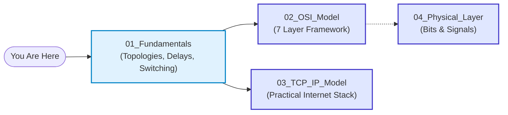

# 01. Computer Networking Fundamentals

> **Master the bedrock of digital communication: understand why networks exist, how data travels across links, why delays occur, and how modern packet switching powers the global Internet.**

| ⏱️ Time Budget | 🎯 Target Level | 📌 GATE Weight | 💼 Interview Weight |
|---|---|---|---|
| 3–4 Hours | Absolute Beginner → Intermediate | Medium (2–4 Marks: Delays, Topologies, BDP) | High (Core definitions, P2P vs Client-Server, Switching) |

---

## 🗺️ Where This Fits

---

## 📋 Prerequisites

None! This is the starting point of the entire curriculum. You only need basic computer familiarity and curiosity about how information travels across the world in milliseconds.

---

## 🎯 What You Will Learn (Checklist)

- [ ] **Network Foundations:** Nodes, links, transmission media, and the 5 essential components of data communication.
- [ ] **History & Evolution:** From ARPANET (1969) to the modern commercial Internet.
- [ ] **Internet Architecture:** Tier-1, Tier-2, and Tier-3 ISPs, Internet Exchange Points (IXPs), and global submarine backbones.
- [ ] **Standards Organizations:** Why interoperability matters (IETF, RFCs, IEEE, ISO, ITU, ICANN/IANA).
- [ ] **Network Classifications:** PAN, LAN, CAN, MAN, WAN, and SAN with real-world distance and hardware limits.
- [ ] **Network Topologies:** Bus, Star, Ring, Mesh, Tree, and Hybrid — trade-offs, cable/port math $n(n-1)/2$, and single points of failure.
- [ ] **Transmission Modes:** Simplex, Half-Duplex, and Full-Duplex with practical examples.
- [ ] **Architectures:** Client-Server vs. Peer-to-Peer (P2P) mechanics and trade-offs.
- [ ] **Switching Techniques:** Circuit Switching vs. Message Switching vs. Packet Switching (Datagram vs. Virtual Circuit).
- [ ] **The 4 Latency Components:** Transmission delay ($T_t$), Propagation delay ($T_p$), Queuing delay ($T_q$), and Processing delay ($T_{\text{proc}}$).
- [ ] **Performance Metrics:** Bandwidth-Delay Product (BDP), Throughput vs. Goodput, Bottleneck links, Packet Loss, and Jitter.

---

## 📂 Files in This Module

| File | What It Gives You | Time |
|---|---|:---:|
| [notes.md](notes.md) | The complete deep-dive conceptual explanation with analogies, formulas, and real-world scenarios | 60–75 min |
| [diagrams.md](diagrams.md) | Visual Mermaid flowcharts, topologies, delay timelines, and Internet hierarchy diagrams | 25–30 min |
| [numericals.md](numericals.md) | Solved calculations across 3 levels (Basic, Exam, GATE-hard) verified with Python | 40–50 min |
| [mcqs.md](mcqs.md) | 55 balanced practice questions (30 MCQs, 10 MSQs, 10 NATs, 5 Scenario challenges) | 45–60 min |
| [interview_qa.md](interview_qa.md) | Top 25 interview questions with 30-second rapid answers and deep architectural explanations | 20–30 min |
| [cheatsheet.md](cheatsheet.md) | High-yield one-page revision sheet summarizing formulas, comparisons, and mnemonics | 10–15 min |

---

## ⬅️ Navigation
- **Previous:** [START_HERE.md](../START_HERE.md) / [INDEX.md](../INDEX.md)
- **Next:** [02_OSI_Model](../02_OSI_Model/README.md)
