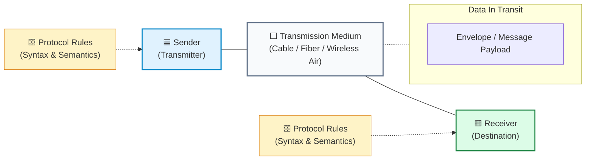
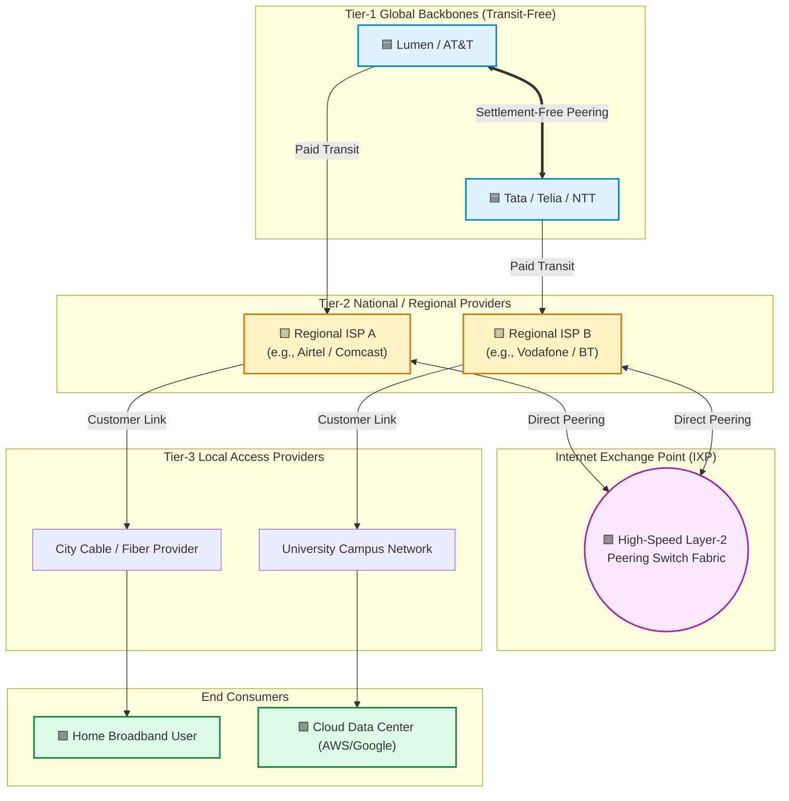
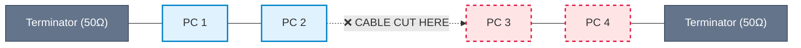
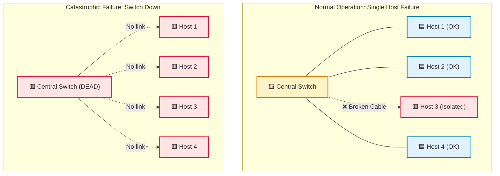
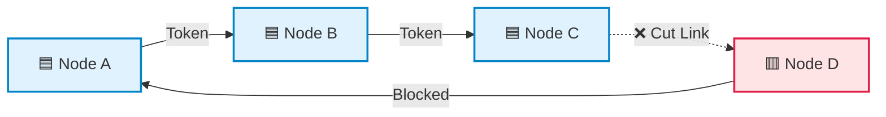
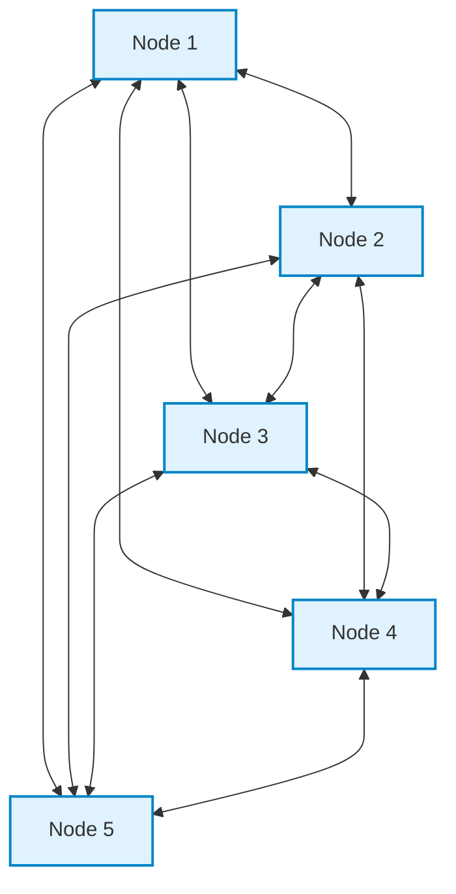
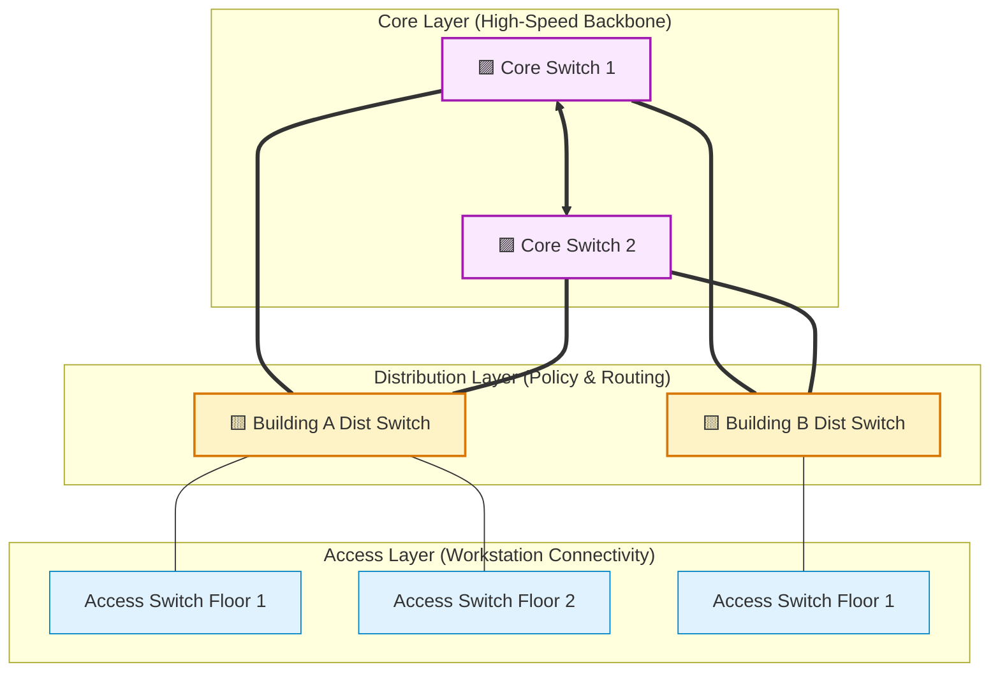
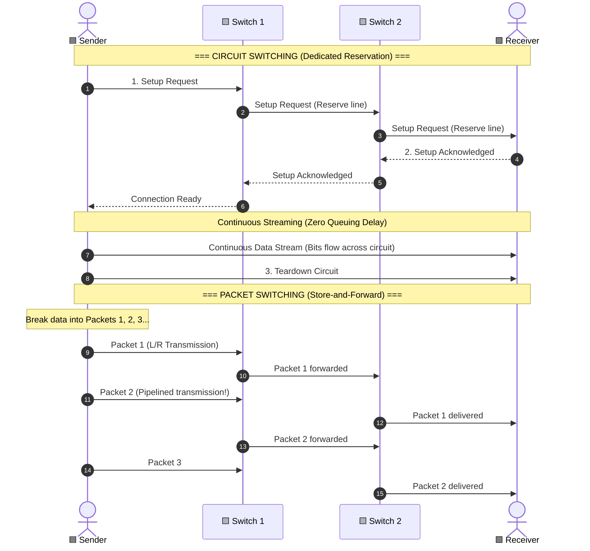
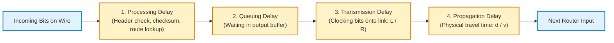
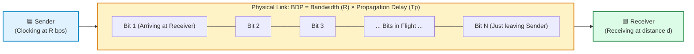

# 01. Computer Networking Fundamentals — Visual Diagram Guide

> **Visual companion to Module 01.**  
> Contains 10 detailed Mermaid diagrams illustrating network topologies, failure scenarios, Internet tier hierarchy, switching comparisons, and latency timelines.

---

## 1. Five Components of Data Communication

> **What to notice:** Communication requires both endpoints, a transmission medium, and an agreed protocol syntax at both ends to interpret the message.

**How to read it:**
- The blue box initiates communication; the green box accepts it.
- Without identical protocol rules at both ends, the receiver receives raw electrical pulses or radio noise without understanding the message structure.

---

## 2. Global Internet Hierarchy: Tiers and IXPs

> **What to notice:** Tier-1 ISPs never pay transit fees to each other; Tier-2 and Tier-3 ISPs pay upstream transit unless they peer directly at an IXP.

**How to read it:**
- Tier-1 backbones have global reach through mutual peering.
- Tier-2 regional ISPs buy transit from Tier-1 but bypass transit costs for regional traffic by exchanging packets through an IXP peering fabric.

---

## 3. Bus Topology & Single Point of Failure

> **What to notice:** All devices share a single electrical copper wire; a cable severed anywhere kills signal propagation for every host on the line.

**How to read it:**
- When the bus is cut between PC 2 and PC 3, electrical impedance changes immediately. Signals reflect back, creating standing wave interference that brings down all nodes on both sides.

---

## 4. Star Topology: Normal vs. Central Switch Failure

> **What to notice:** Individual cable cuts only affect that specific node; however, a central switch failure collapses the entire LAN.

**How to read it:**
- **Scenario A:** If Host 3's Ethernet patch cord is unplugged, Hosts 1, 2, and 4 continue communicating at full speed.
- **Scenario B:** The central switch is the single point of failure (SPOF) for the star topology.

---

## 5. Ring Topology: Token Passing & Link Break

> **What to notice:** In a unidirectional ring, any broken link halts circulating tokens unless a dual counter-rotating ring (FDDI style) wraps around the fault.

**How to read it:**
- A token is passed sequentially around the ring. Once the link between C and D is cut, the token cannot complete the circuit back to A, halting the entire network.

---

## 6. Full Mesh Topology (5 Nodes)

> **What to notice:** Every node has a direct link to all other 4 nodes. Number of duplex links = $\frac{5 \times 4}{2} = 10$.

**How to read it:**
- Each node requires $n-1 = 4$ network interface ports.
- Even if 3 links fail simultaneously, alternative paths remain open.

---

## 7. Hierarchical Tree Topology (Campus LAN)

> **What to notice:** Traffic flows up through Core and Distribution layers before descending to the destination Access switch.

**How to read it:**
- Access switches connect directly to desktops.
- Distribution switches enforce security policies and routing between VLANs.
- Core switches provide fast, unthrottled transport between buildings.

---

## 8. Circuit Switching vs. Packet Switching (Timeline Comparison)

> **What to notice:** Circuit switching requires a dedicated round-trip setup delay before transmitting; packet switching starts transmitting immediately with per-hop store-and-forward delay.

**How to read it:**
- In circuit switching, no data travels until step 2 completes.
- In packet switching, packet transmission is pipelined across switches, significantly speeding up bursty transfers.

---

## 9. The 4 Delay Components Across a Single Router Hop

> **What to notice:** Total node latency is the sum of two variable delays (queuing, processing) and two physical deterministic delays (transmission, propagation).

**How to read it:**
- $D_{\text{proc}}$: Computational delay inside the CPU/ASIC ($\mu\text{s}$).
- $D_{\text{queue}}$: Congestion-dependent buffer delay ($0$ to seconds).
- $D_{\text{trans}}$: $L/R$ — pushes bits from memory into the wire.
- $D_{\text{prop}}$: $d/v$ — electromagnetic propagation across copper or glass.

---

## 10. Bandwidth-Delay Product (BDP) as a "Bit Pipe"

> **What to notice:** BDP represents the total volume of bits in flight filling the cable pipe before the first bit reaches the destination.

**How to read it:**
- If the link has high bandwidth (1 Gbps) and high delay (satellite or trans-Atlantic, 100 ms), the pipe holds millions of bits simultaneously.
- If the sender stops transmitting while waiting for an acknowledgment, this entire pipe empties, wasting available channel capacity.
