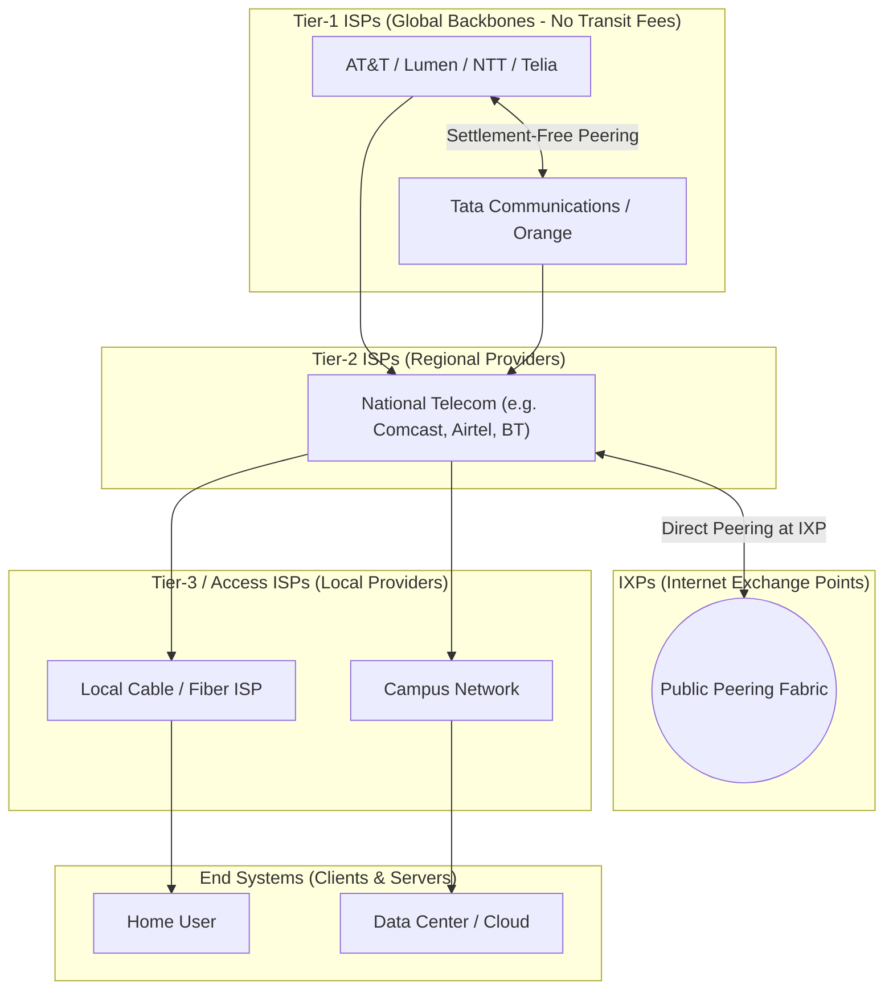
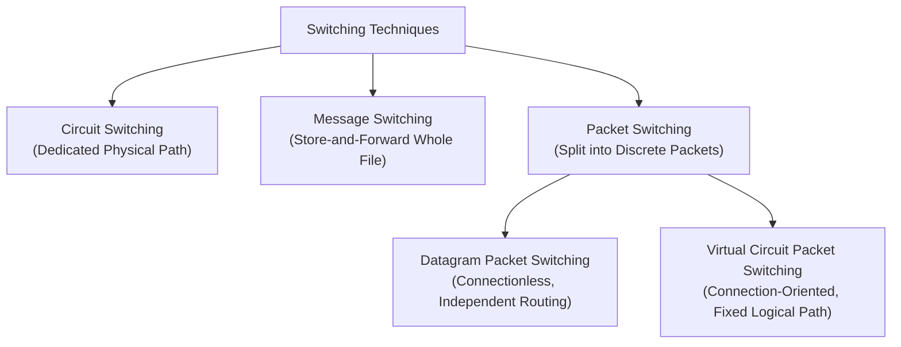

# Computer Networking Fundamentals

> **Module 01: Core Architecture, Topologies, Delays, and Switching Techniques**  
> *"Before a single web page can load, physical electrons and photons must traverse wires, negotiate shared paths, and overcome physical propagation limits across continents."*

---

## 1. Why Computer Networks Exist

### 1.1 The Fundamental Problem
A computer network is an interconnected collection of autonomous computing devices capable of exchanging data and sharing hardware and software resources through communication links.

> **💡 Why this exists:**  
> In the 1960s, computing machines were massive mainframes. If an engineer at Stanford needed a dataset computed by a mainframe at MIT, they had to record data onto magnetic tape reels, physically pack them in a box, and ship them via courier ("sneakernet"). Networks were created to eliminate physical courier delays, allow expensive resources (printers, supercomputers, storage) to be shared dynamically, and provide fault-tolerant communications during physical line interruptions.

### 1.2 Real-World Analogy: The Global Postal & Courier System
To build an intuitive mental model, compare a digital computer network to a global postal service:
- **Host / Node:** The sender writing the letter or the recipient reading it.
- **Data Packet:** The envelope containing a chunk of the message.
- **IP Address:** The geographic postal street address printed on the envelope.
- **MAC Address:** The recipient's government ID or fingerprint ensuring hand-to-hand delivery at the doorstep.
- **Router / Switch:** The postal sorting centers that inspect zip codes and direct envelopes onto the right outgoing trucks.
- **Transmission Medium:** The roads, highways, railways, and air corridors carrying the physical mail.
- **Network Protocol:** The agreed language, postal customs regulations, and envelope formatting rules required for successful delivery.

---

## 2. History & Evolution: From ARPANET to the Modern Internet

The Internet was not designed in a day; it evolved through three defining eras:

1. **ARPANET (1969):** Funded by DARPA (US Defense Advanced Research Projects Agency). The first operational packet-switching network connecting four universities (UCLA, Stanford Research Institute, UC Santa Barbara, and University of Utah). On October 29, 1969, the first message ("LO", intended to be "LOGIN" before a crash) was transmitted between UCLA and Stanford.
2. **The Birth of TCP/IP (1983):** On January 1, 1983 ("Flag Day"), ARPANET officially replaced its original NCP (Network Control Program) with the TCP/IP protocol suite designed by Vint Cerf and Bob Kahn, forming the true foundation of the modern Internet.
3. **The World Wide Web (1989–1991):** Tim Berners-Lee at CERN invented HTML, HTTP, and URLs, transforming an academic and military communication medium into a global public hyperlinked web.
4. **Commercialization & Broadband (1995–Present):** NSFNET decommissioned its backbone for commercial backbones; expansion into fiber-optic undersea cables, 4G/5G mobile data, and cloud data centers.

---

## 3. Five Components of Data Communication & Protocol Anatomy

Data communication is the exchange of data between two devices via a transmission medium. Every communication system requires five mandatory elements:

```
[ Sender ] ───(Protocol Rules)───▶ [ Transmission Medium ] ───(Protocol Rules)───▶ [ Receiver ]
    │                                      ▲                                      │
    └────────────────── [ Message / Data Payload ] ───────────────────────────────┘
```

1. **Message (Data):** The information being communicated (text, audio, video, sensor readings).
2. **Sender:** The device generating and transmitting the message (PC, phone, camera).
3. **Receiver:** The device intended to receive the message.
4. **Transmission Medium:** The physical path over which the signal travels (twisted-pair copper, optical fiber, radio waves).
5. **Protocol:** The set of rules governing data communications.

### 3.1 What is a Protocol? (Syntax, Semantics, Timing)
A protocol defines **what** is communicated, **how** it is communicated, and **when** it is communicated. It consists of three key elements:

- **Syntax:** The structure or format of the data (e.g., the first 4 bits indicate the IP version, the next 4 bits indicate header length).
- **Semantics:** The meaning of each section of bits (e.g., does bit pattern `1100` mean a connection request or a reset command?).
- **Timing:** Two key characteristics: *when* data should be sent and *how fast* it can be transmitted (synchronization and speed matching).

> **🧠 Remember:**  
> A protocol without **Syntax** is unreadable; without **Semantics** is meaningless; without **Timing** causes collisions and buffer overflows.

---

## 4. Network Standards Bodies

Interoperability across millions of vendors requires strict open standards. The key bodies are:

| Organization | Full Name | Primary Responsibility | Key Examples |
|---|---|---|---|
| **IETF** | Internet Engineering Task Force | Develops Internet standards and publishes **RFCs** (Requests for Comments). | IP (RFC 791), TCP (RFC 9293), HTTP (RFC 9110) |
| **IEEE** | Institute of Electrical and Electronics Engineers | Defines physical and data link standards for local and metropolitan networks. | IEEE 802.3 (Ethernet), IEEE 802.11 (Wi-Fi) |
| **ISO** | International Organization for Standardization | International standard-setting body. | ISO 7498-1 (OSI 7-Layer Reference Model) |
| **ITU-T** | International Telecommunication Union (Telecom) | Global standards for telecommunications and radio spectrum. | V-series modems, G-series optical transmission |
| **ICANN / IANA** | Internet Corporation for Assigned Names and Numbers | Manages global IP address allocations, ASNs, and DNS root zone. | Top-Level Domains (.com, .org), IPv4/v6 pools |
| **W3C** | World Wide Web Consortium | Develops open standards for the World Wide Web. | HTML5, CSS3, WebAssembly |

---

## 5. Network Classification by Scale

Networks are classified by their geographic radius, transmission technologies, and administrative ownership:

| Network Type | Full Form | Geographic Coverage | Typical Media & Speeds | Common Real-World Example |
|---|---|---|---|---|
| **PAN** | Personal Area Network | $\le 10$ meters | Bluetooth, Zigbee, USB ($\le 3$ Mbps) | Smartphone paired to smartwatch/earbuds |
| **LAN** | Local Area Network | Room, Office, Building ($\le 1$ km) | Ethernet (Cat6), Wi-Fi (100 Mbps – 10 Gbps) | College lab, home Wi-Fi network, office floor |
| **CAN** | Campus Area Network | Contiguous campus ($1$ – $5$ km) | Multi-mode/Single-mode fiber backbones | University campus, military base, corporate park |
| **MAN** | Metropolitan Area Network | City-wide ($5$ – $50$ km) | Metro-Ethernet, Coaxial, Dark fiber | City cable television network, municipal Wi-Fi |
| **WAN** | Wide Area Network | Country, Continent, Global | Submarine optical fiber, satellite links | The Internet, global enterprise banking network |
| **SAN** | Storage Area Network | Data center server room | Fibre Channel (FC), iSCSI, InfiniBand | High-speed dedicated block-storage cluster |

---

## 6. Structure of the Global Internet: Tiers & IXPs

The Internet is not a single cloud; it is a **network of networks** arranged in a hierarchical economic structure:



1. **Tier-1 ISPs:** Giant global telecom backbones (e.g., Lumen, AT&T, Tata Communications, NTT). They do not pay anyone for transit because they peer with all other Tier-1 backbones via **settlement-free peering agreements**.
2. **Tier-2 ISPs:** Regional and national providers (e.g., Comcast, Vodafone, Airtel). They buy commercial transit from Tier-1 ISPs to reach the rest of the world, but may peer with each other to exchange local traffic.
3. **Tier-3 / Access ISPs:** The local providers that connect directly to residential homes and small businesses (last-mile connectivity).
4. **IXPs (Internet Exchange Points):** Physical data center switching facilities where multiple ISPs, CDNs (Cloudflare, Akamai), and tech giants (Google, Netflix) peer directly to exchange traffic without paying upstream transit costs.

---

## 7. Network Topologies: Mechanics, Formulas & Failure Modes

A **topology** defines the geometric arrangement of nodes and links. Topologies can be evaluated across five criteria: cost, scalability, fault tolerance, cable complexity, and single points of failure.

### 7.1 Bus Topology
- **Mechanics:** All devices attach to a single continuous shared coaxial transmission line (the "bus" or backbone). Both physical cable ends require **50-ohm terminators** to absorb electrical signals and prevent reflections.
- **Collision Behavior:** Any simultaneous transmission results in an electrical collision (half-duplex).
- **Failure Mode:** A single cable cut or severed terminator collapses the entire network.

### 7.2 Star Topology
- **Mechanics:** Every end node connects directly to a central multiport device (switch or hub) via point-to-point dedicated links.
- **Failure Mode:** If an individual cable or node fails, only that node goes offline. If the central switch fails, the entire subnet fails.
- **Prevalence:** The universal standard for all modern wired Ethernet LANs and Wi-Fi networks.

### 7.3 Ring Topology
- **Mechanics:** Each node connects to exactly two neighbors, forming an unbroken closed circular path. Tokens or data packets circulate in one direction (unidirectional) or both (dual counter-rotating ring like FDDI).
- **Failure Mode:** In a single ring, the failure of one host or link breaks the loop for all nodes. Dual rings mitigate this by folding back on themselves during link cuts.

### 7.4 Mesh Topology (Full Mesh vs. Partial Mesh)
- **Mechanics:** Every node connects to every other node via dedicated point-to-point links.

> **📌 GATE Formula: Mesh Topology**  
> For a network of $n$ nodes:
> - **Number of duplex links in Full Mesh:**  
>   $$N_{\text{links}} = \frac{n(n - 1)}{2}$$
> - **I/O ports required per node:**  
>   $$P = n - 1$$
> - **Total hardware ports in the network:**  
>   $$P_{\text{total}} = n(n - 1)$$

*Worked Example:* A bank connects 12 regional data centers in full mesh.  
- Links needed: $\frac{12 \times 11}{2} = 66$ dedicated high-speed leased lines.
- Ports required per router: $11$ ports.
- Total ports across all routers: $132$ ports.

### 7.5 Tree (Hierarchical) Topology
- **Mechanics:** Multi-tiered star topologies branching out from a root distribution switch into access switches. Standard design for enterprise campus networks.

### 7.6 Topology Comparison Matrix

| Topology | Cable Length Required | Fault Isolation | Scalability | Single Point of Failure? | Modern Use Case |
|---|:---:|:---:|:---:|:---:|---|
| **Bus** | Lowest | Extremely Poor | Difficult | Yes (Backbone cable or terminator) | Legacy industrial automation |
| **Star** | Moderate | Excellent | Very Easy | Yes (Central switch) | Corporate LANs, Home Wi-Fi |
| **Ring** | Low | Poor (Single ring) | Moderate | Yes (Any link in single ring) | Metro optical transport (SONET/SDH) |
| **Full Mesh** | $O(n^2)$ (Extreme) | Superb | Very Costly | None | ISP core backbones, SANs |
| **Tree** | Moderate–High | Good | Excellent | Yes (Root switch failure) | Multi-floor enterprise buildings |

---

## 8. Transmission Modes: Simplex, Half-Duplex & Full-Duplex

| Mode | Direction of Data Flow | Channel Capacity Utilization | Real-World Examples | Everyday Analogy |
|---|---|---|---|---|
| **Simplex** | Strictly **unidirectional** (Node A $\rightarrow$ Node B only). Receiver cannot reply. | Entire bandwidth dedicated to one direction. | Traditional FM Radio, TV broadcast, Keyboard to CPU, GPS satellites. | A one-way street; printed book. |
| **Half-Duplex** | **Bidirectional, but alternating** (only one station transmits at a time). | Bandwidth shared in time domain; collisions possible if both speak. | Walkie-Talkies, original coaxial 10BASE2 Ethernet, 802.11 Wi-Fi. | A single-lane bridge with traffic lights at both ends. |
| **Full-Duplex** | **Bidirectional, simultaneous** (both stations transmit and receive at once). | Dedicated physical paths or frequency separation; zero collisions. | Modern switched Ethernet (Cat6 full duplex), Telephone mobile call. | A two-lane highway with traffic flowing both ways simultaneously. |

---

## 9. Network Architectures: Client-Server vs. Peer-to-Peer (P2P)

```
       CLIENT-SERVER                              PEER-TO-PEER (P2P)
       
         [Server]                                [Peer A] <───> [Peer B]
        /   │    \                                   ▲           ▲
       /    │     \                                  │           │
   [PC1]  [PC2]  [PC3]                               ▼           ▼
                                                 [Peer D] <───> [Peer C]
```

### 9.1 Client-Server Architecture
- **Roles:** Dedicated, centralized high-performance machines (**servers**) listen for and fulfill requests initiated by consumer machines (**clients**).
- **Data Location:** Centralized databases, cloud storage buckets, or web servers.
- **Advantages:** Centralized access control, simplified backup procedures, high security, and easy accounting.
- **Disadvantages:** Server is a central bottleneck and single point of failure; requires costly enterprise server hardware.

### 9.2 Peer-to-Peer (P2P) Architecture
- **Roles:** Every connected workstation (**peer**) has equivalent capabilities and responsibilities. A peer acts simultaneously as a client (requesting chunks) and a server (seeding chunks to other peers).
- **Data Location:** Distributed across hundreds or thousands of participating nodes.
- **Advantages:** High fault tolerance (no central server to crash), massive aggregate bandwidth (the more downloaders join, the more upload capacity enters the network), cost efficiency.
- **Disadvantages:** Decentralized security is difficult, discovery overhead, and content availability depends on peer seeding behavior.

---

## 10. Switching Techniques: Circuit, Message & Packet Switching

How does data travel from source to destination across a mesh of intermediate switches?



### 10.1 Circuit Switching
1. **Three Phases:**
   - **Connection Setup:** A dedicated physical circuit is reserved across all switches along the path (e.g., telephone call dialing).
   - **Data Transfer:** Bits flow continuously with zero queuing delay.
   - **Circuit Teardown:** Resources (frequency slots, physical lines) are deallocated.
2. **Trade-offs:** Guarantees constant bandwidth and deterministic latency. However, if neither party speaks, the allocated bandwidth is wasted (**low line efficiency**).

### 10.2 Message Switching (Historical)
- Entire message is treated as a single block. Intermediate nodes store the whole file on disk, verify its integrity, and then forward it to the next node (**Store-and-Forward**).
- **Fatal Flaws:** Required huge intermediate disk buffers; a single bit error required retransmitting the entire massive file; head-of-line blocking stalled short messages behind large files.

### 10.3 Packet Switching (The Basis of the Internet)
- The application message is broken down into small, standardized chunks called **packets** (typically $\le 1500$ bytes).
- Each packet contains a header with control data (source IP, destination IP, sequence number).
- Packets are queued and forwarded hop-by-hop across statistical multiplexing links.

#### Datagram Packet Switching (Connectionless)
- Each packet is treated independently. Two packets of the exact same message can take completely different geographic routes depending on link congestion.
- Packets may arrive **out of order**; the receiver's transport layer (TCP) is responsible for reassembly.

#### Virtual Circuit Packet Switching (Connection-Oriented)
- A logical path (Virtual Circuit Identifier, VCI) is negotiated before transmission (e.g., X.25, Frame Relay, ATM, MPLS).
- All packets carry a small VCI tag and follow the exact same path in order, without full 32-bit IP lookup at every intermediate hop.

### 10.4 Switching Comparison Table

| Feature | Circuit Switching | Datagram Packet Switching | Virtual Circuit Packet Switching |
|---|---|---|---|
| **Path Established?** | Dedicated physical path before data transfer | No dedicated path; evaluated hop-by-hop | Yes, logical connection setup phase |
| **Dedicated Bandwidth?** | Yes, strictly reserved | No, dynamic statistical multiplexing | Bandwidth can be reserved or shared |
| **Out-of-Order Delivery?** | Impossible | Possible (frequent during routing shifts) | Impossible (ordered delivery guaranteed) |
| **Store-and-Forward Delay?** | None during transfer | Yes, per packet at each router hop | Yes, per packet, but fast label lookup |
| **Failure Handling** | Path severed = call dropped immediately | Routers dynamically detour around broken links | Circuit drops; must re-establish VC |
| **Resource Efficiency** | Low (idle time wasted) | Highest (idle channels used by other flows) | Moderate–High |

---

## 11. Latency & Delay Components: The Mathematical Core

When sending a packet across a link, the total node delay is the sum of four distinct physical components:

$$D_{\text{nodal}} = D_{\text{trans}} + D_{\text{prop}} + D_{\text{queue}} + D_{\text{proc}}$$

```
[ Router A ] ══════════════════════════════════════════════════════════▶ [ Router B ]
     │                                                                        ▲
     ├─ D_proc  (Examine header, check bit errors)                           │
     ├─ D_queue (Wait in output queue for link to become free)               │
     ├─ D_trans (Clock bits out onto wire: L / R)                            │
     └─ D_prop  (Physical travel time of electromagnetic wave: d / v) ────────┘
```

### 11.1 Transmission Delay ($T_t$ or $D_{\text{trans}}$)
The time required to push (clock) all the bits of the packet onto the physical transmission wire.
- **Formula:**
  $$T_t = \frac{L}{R}$$
  - $L$ = Length of the packet in **bits**
  - $R$ = Transmission rate / Bandwidth of the link in **bits per second (bps)**
- **What affects it:** Packet size and interface speed. Distance has **zero** effect on $T_t$.

### 11.2 Propagation Delay ($T_p$ or $D_{\text{prop}}$)
The time taken for a single bit to physically travel from the beginning of the transmission medium to the receiving end at the speed of light in that medium.
- **Formula:**
  $$T_p = \frac{d}{v}$$
  - $d$ = Distance of the physical link in **meters**
  - $v$ = Propagation velocity through the medium ($\approx 2 \times 10^8\text{ m/s}$ in copper and glass fiber; $\approx 3 \times 10^8\text{ m/s}$ in vacuum/air)
- **What affects it:** Distance and physical medium properties. Link bandwidth has **zero** effect on $T_p$.

> **⚠️ Common Trap: Transmission vs. Propagation Delay**  
> Beginners constantly confuse $T_t$ and $T_p$:
> - **Transmission Delay ($T_t$):** How long the toll booth attendant takes to swipe cars through the gate (depends on number of cars and attendant speed).
> - **Propagation Delay ($T_p$):** How long a car takes to drive 100 km on the highway from toll booth A to toll booth B (depends on speed limit and distance).

### 11.3 Queuing Delay ($T_q$ or $D_{\text{queue}}$)
The time a packet waits in the router's memory buffer queue before it can be transmitted onto the outgoing link.
- **Traffic Intensity:** Let packet arrival rate be $a$ packets/sec, packet length $L$ bits, link rate $R$ bps.  
  $$\text{Traffic Intensity} = \frac{a \cdot L}{R}$$
  - If $\frac{aL}{R} \le 0.5$: Average queuing delay is minimal.
  - If $\frac{aL}{R} \rightarrow 1$: Queue lengths explode toward infinity.
  - If $\frac{aL}{R} > 1$: Arriving bits exceed link capacity; router buffer overflows, resulting in **packet loss**.

### 11.4 Processing Delay ($T_{\text{proc}}$ or $D_{\text{proc}}$)
The time required by the router's CPU or ASIC to examine the packet header, verify the checksum, check for bit corruption, and determine the output interface via routing table lookup. Typically measured in microseconds ($\mu\text{s}$).

### 11.5 Total End-to-End Delay Over $N$ Links (Store-and-Forward)
For a message consisting of $k$ packets of size $L$ bits sent over $N$ identical links of bandwidth $R$ bps and propagation delay $T_p$ per link:

$$\text{Total Time} = (k + N - 1) \times \frac{L}{R} + N \times T_p$$

---

## 12. Bandwidth-Delay Product (BDP)

The **Bandwidth-Delay Product (BDP)** defines the maximum number of bits that can be "in flight" inside the physical communication pipe at any given moment:

$$\text{BDP} = R \times \text{RTT} \quad \text{(or } R \times T_p \text{ for one-way)}$$

- **Analogy:** Think of a water pipe. The cross-sectional width of the pipe is the bandwidth ($R$), and the length of the pipe is the delay ($T_p$). The total volume of water held inside the pipe at full flow is the BDP.
- **Why It Matters:** In transport protocols like TCP, the sender's window size must be at least equal to the BDP to keep the bottleneck link 100% utilized without stalling for acknowledgments.

---

## 13. Throughput, Goodput, Bottleneck Link, Packet Loss & Jitter

### 13.1 Bandwidth vs. Throughput vs. Goodput
- **Bandwidth:** The theoretical upper capacity limit of a channel:
  - *In Digital Networks:* Measured in bits/sec (bps, Mbps, Gbps).
  - *In Analog / RF Physics:* Measured in Hertz (Hz) — the width of the frequency spectrum ($f_{\max} - f_{\min}$).
- **Throughput:** The actual rate at which raw data (including all protocol headers) is successfully transferred over the link per unit time.
- **Goodput:** The rate of **useful application payload** bits delivered to the receiving software, excluding TCP/IP headers, Ethernet preambles, and retransmitted dropped packets.

$$\text{Goodput} = \text{Throughput} \times \frac{\text{Application Data Bytes}}{\text{Total Wire Bytes}}$$

### 13.2 Bottleneck Link
In a multi-hop transmission path, the end-to-end throughput is constrained by the link with the smallest transmission capacity:

$$\text{Throughput}_{\text{end-to-end}} \le \min(R_1, R_2, R_3, \dots, R_m)$$

### 13.3 Packet Loss
If a packet arrives at an intermediate switch whose memory buffer is completely full, the switch has no choice but to drop the packet (**Buffer Drop**). The transport layer (TCP) must detect this timeout or duplicate acknowledgment and retransmit the missing segment.

### 13.4 Jitter
Jitter is the **variation in latency** (packet arrival delay variance) across successive packets in the same flow.
- A steady 50 ms delay across all packets has **zero jitter**.
- Packets arriving at 20 ms, 140 ms, 35 ms, and 210 ms suffer from high jitter.
- High jitter causes audio robotic distortion and frame stutter in real-time interactive applications (VoIP, Zoom calls, multiplayer online gaming). Buffering at the receiver application smooths jitter at the expense of added fixed delay.

---

## 14. Exam & Interview Insights

### What Placements & FAANG Ask
1. **"Explain the step-by-step difference between Circuit Switching and Packet Switching."**
   - *Key Points:* Resource reservation vs. statistical multiplexing; constant delay vs. variable queuing; call-blocking vs. congestion loss.
2. **"Why does increasing link bandwidth not reduce ping latency between London and Tokyo?"**
   - *Answer:* Increasing bandwidth ($R$) reduces transmission delay ($T_t = L/R$), which for small ping packets is already fractional microseconds. Latency between London and Tokyo is dominated by propagation delay ($T_p = d/v$), which is bound by the physical speed of light in fiber optic glass over 10,000 kilometers ($\approx 50\text{ ms}$).
3. **"In a full mesh of $N$ nodes, how many cables and ports are needed?"**
   - Quote $\frac{N(N-1)}{2}$ links and $N-1$ ports per node immediately.

---

## 15. Summary

1. Networks exist to solve resource-sharing and eliminate physical transportation bottlenecks.
2. Protocols dictate communication through **Syntax** (format), **Semantics** (meaning), and **Timing** (speed and coordination).
3. The Internet is a hierarchical federation of Tier-1, Tier-2, and Tier-3 ISPs interchanging traffic at Internet Exchange Points (IXPs).
4. Topologies govern physical layouts; star topology dominates modern LANs, while full mesh maximizes reliability at quadratic $O(n^2)$ cable cost.
5. Communication modes are classified as Simplex (one-way), Half-Duplex (two-way alternating), and Full-Duplex (two-way concurrent).
6. Packet switching outperforms circuit switching for bursty data communications via statistical multiplexing.
7. Total latency is composed of four factors: $D_{\text{trans}} = L/R$, $D_{\text{prop}} = d/v$, $D_{\text{queue}}$, and $D_{\text{proc}}$.
8. Bandwidth-Delay Product represents the capacity volume of a link pipe ($R \times \text{RTT}$).
9. Goodput represents pure application payload rate, strictly lower than wire throughput.
10. Jitter is packet arrival delay variance, mitigated by jitter buffers in real-time media.

---

## 16. Quick Revision Checklist

- [ ] Can write down the 5 components of data communication and 3 protocol elements.
- [ ] Can draw the Internet Tier structure (Tier-1, Tier-2, Tier-3, IXP).
- [ ] Can calculate links and ports for a full mesh topology of $N$ nodes.
- [ ] Can state the formulas for $T_t = L/R$ and $T_p = d/v$ and identify what affects each.
- [ ] Can explain why packet switching allows more concurrent users than circuit switching.
- [ ] Can calculate BDP given bandwidth and round-trip time.
- [ ] Can define the difference between throughput and goodput with header overhead.

---

## ⬅️ Navigation
- **Module Overview:** [README.md](README.md)
- **Visual Diagrams:** [diagrams.md](diagrams.md)
- **Solved Numericals:** [numericals.md](numericals.md)
- **Practice Questions:** [mcqs.md](mcqs.md)
- **Next Module:** [02_OSI_Model](../02_OSI_Model/README.md)
