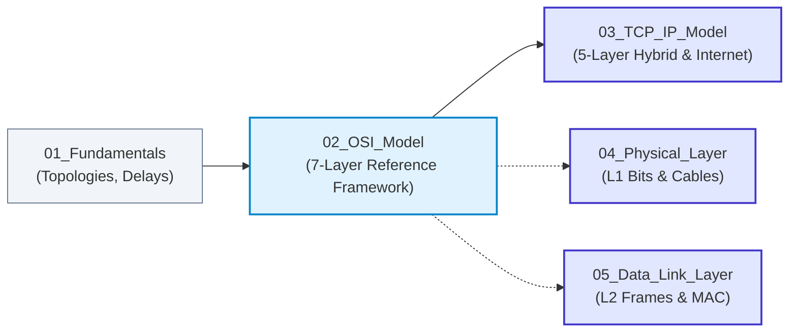

# 02. The OSI 7-Layer Reference Model

> **Master the universal architectural framework of computer networking: understand how the 7 layers divide responsibilities, how encapsulation builds nested protocol packets, and how to troubleshoot networks layer by layer.**

| ⏱️ Time Budget | 🎯 Target Level | 📌 GATE Weight | 💼 Interview Weight |
|---|---|---|---|
| 3–4 Hours | Beginner → Intermediate | Low–Medium (1–2 Marks: PDU mapping, Encapsulation) | Very High (Universally asked in interviews and placement screens) |

---

## 🗺️ Where This Fits

---

## 📋 Prerequisites

- [01_Fundamentals/notes.md](../01_Fundamentals/notes.md) — Basic understanding of nodes, links, and the 5 components of data communication.

---

## 🎯 What You Will Learn (Checklist)

- [ ] **The 7 Layers in Both Directions:** Physical, Data Link, Network, Transport, Session, Presentation, Application (and mnemonics).
- [ ] **Fixed Layer Identity Cards:** Job, PDU name, Addressing scheme, Protocols, Devices, Real-world example, and *"What breaks if this layer fails"*.
- [ ] **Encapsulation & Decapsulation:** Exact byte additions across layers (Ethernet 14+4, IPv4 20, TCP 20) and header nesting mechanics.
- [ ] **Three Core Concepts:** Services vs. Protocols vs. Interfaces.
- [ ] **Connection Types:** Connection-Oriented vs. Connectionless operation at each layer.
- [ ] **Critical Architectural Traps:**
  - Why the term **"Gateway"** is overloaded (Default Gateway = Router at L3 vs. Application/Protocol Gateway at L7).
  - Why **TLS/SSL** does not map cleanly to Layer 6 (it runs between L4 and L7).
  - Why **Firewalls** operate at L3, L4, or L7 depending on their type.
- [ ] **Historical Context:** Why the OSI model lost to the TCP/IP suite in the real-world market.
- [ ] **Systematic Troubleshooting:** Bottom-up vs. Top-down diagnosis methodology.

---

## 📂 Files in This Module

| File | What It Gives You | Time |
|---|---|:---:|
| [notes.md](notes.md) | Comprehensive conceptual notes with layer cards, encapsulation byte maps, and trap analyses | 60–75 min |
| [diagrams.md](diagrams.md) | Mermaid sequence diagrams, layer interaction flows, and byte-level encapsulation architecture | 25–30 min |
| [mcqs.md](mcqs.md) | 55 balanced practice questions (30 MCQs, 10 MSQs, 10 NATs, 5 Scenario challenges) | 45–60 min |
| [interview_qa.md](interview_qa.md) | Classic OSI interview questions ("Ping works but browser doesn't", "Which layer is TLS?", "Router vs L3 Switch") | 25–30 min |
| [cheatsheet.md](cheatsheet.md) | One-page printable summary of PDUs, layer jobs, header overheads, and mnemonics | 10–15 min |

---

## ⬅️ Navigation
- **Previous:** [01_Fundamentals](../01_Fundamentals/README.md)
- **Next:** [03_TCP_IP_Model](../03_TCP_IP_Model/README.md)
