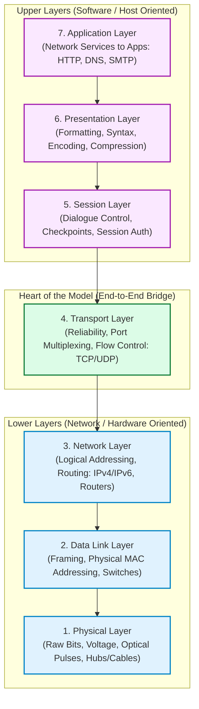
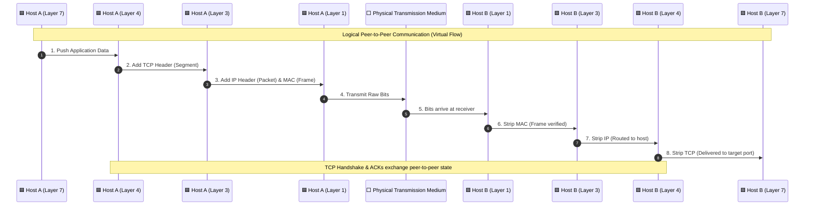
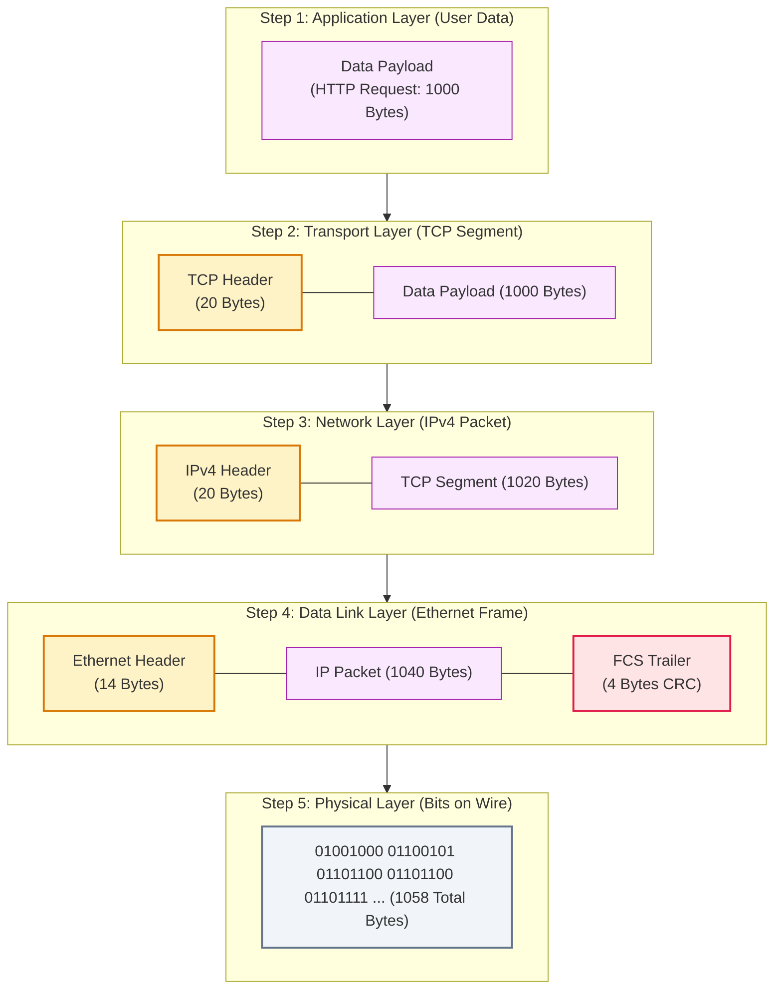
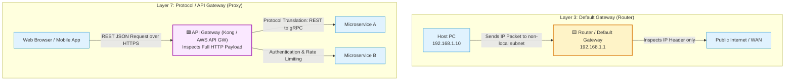
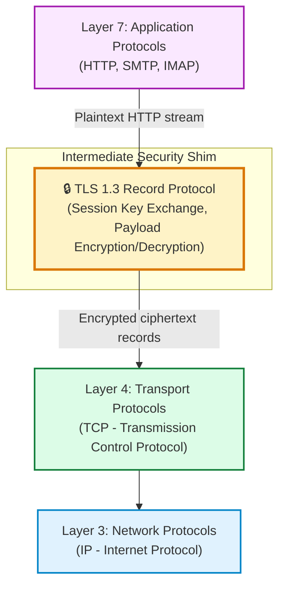
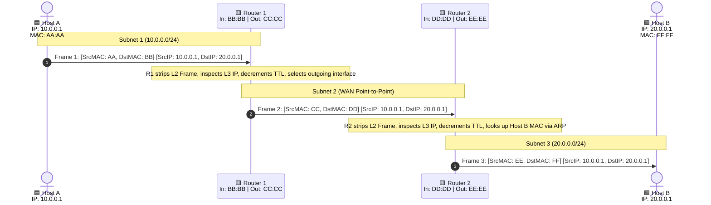
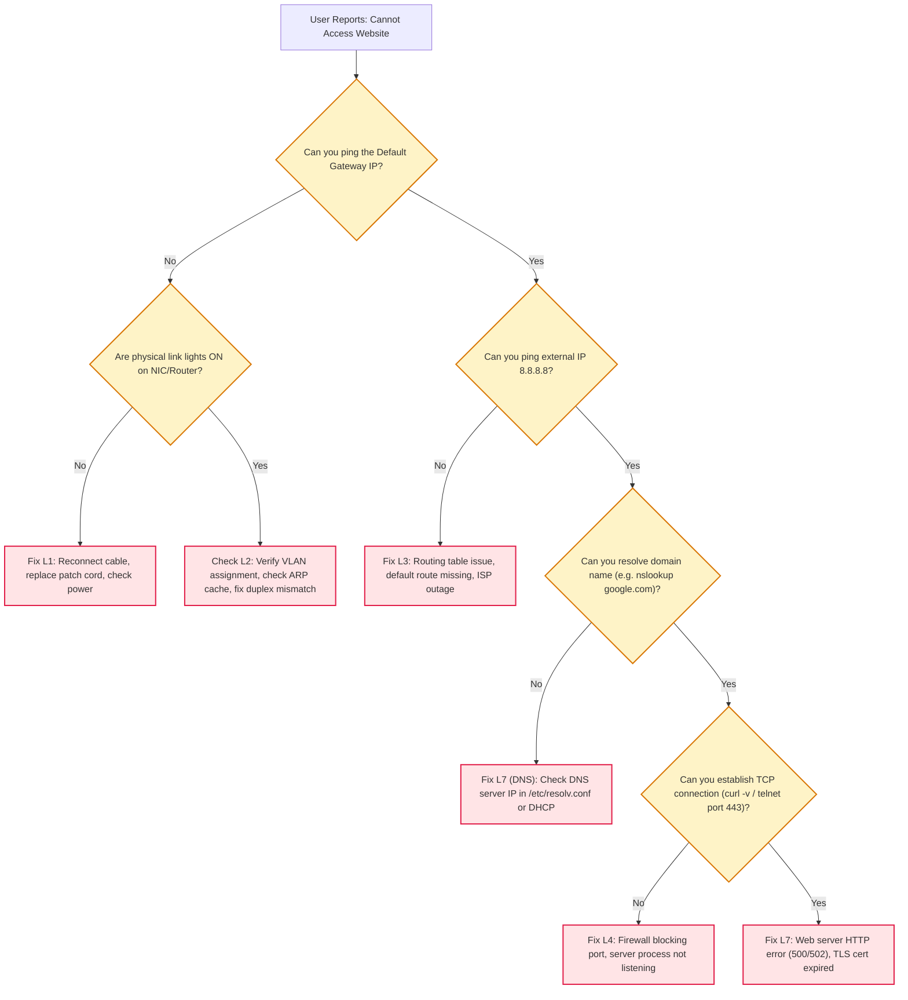
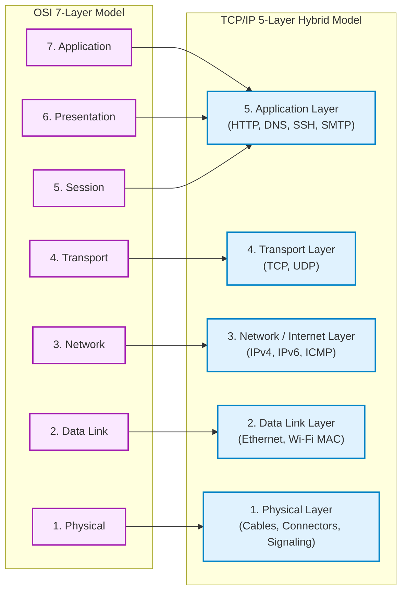
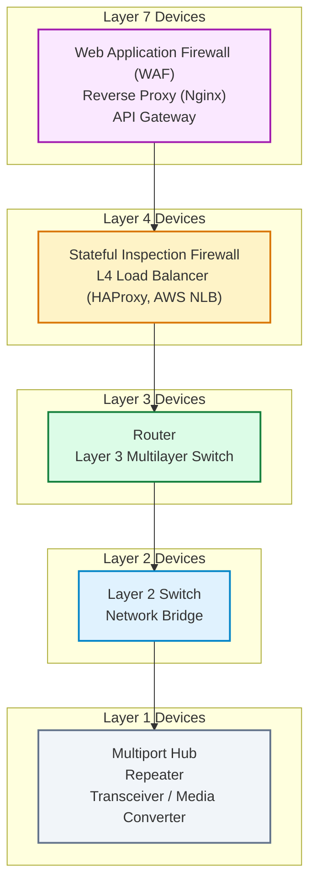

# 02. The OSI 7-Layer Model — Visual Diagram Guide

> **Visual companion to Module 02.**  
> Contains 10 detailed Mermaid diagrams illustrating the 7-layer stack, peer-to-peer virtual flow, byte-level encapsulation, firewall positioning, TLS placement, and diagnostic decision trees.

---

## 1. The 7-Layer OSI Architecture & Responsibility Stack

> **What to notice:** Layers 1–3 are physical network/link oriented; Layers 5–7 are host application oriented; Layer 4 is the end-to-end bridge.



**How to read it:**
- When an application transmits data, execution flows from top (L7) to bottom (L1).
- When a packet arrives from the network wire, execution flows from bottom (L1) up to the application (L7).

---

## 2. Peer-to-Peer Virtual Flow vs. Actual Physical Flow

> **What to notice:** Logically, Layer $N$ on Host A communicates with Layer $N$ on Host B; physically, data must descend down to Layer 1, traverse the wire, and ascend up on the other side.



**How to read it:**
- Blue nodes are the sender stack; green nodes are the receiver stack.
- The transport layer on Host A exchanges sequence numbers directly with the transport layer on Host B, independent of intermediate network switches.

---

## 3. Step-by-Step Encapsulation with Exact Byte Overheads

> **What to notice:** Each layer wraps the entire PDU from the layer above inside its own data payload field and adds header bytes.



**How to read it:**
- User payload = 1000 Bytes.
- TCP Segment = $1000 + 20 = 1020\text{ Bytes}$.
- IP Packet = $1020 + 20 = 1040\text{ Bytes}$.
- Ethernet Frame = $14 + 1040 + 4 = 1058\text{ Bytes}$ on physical wire.
- Wire efficiency = $\frac{1000}{1058} \approx 94.5\%$.

---

## 4. The Gateway Clarification: L3 Default Gateway vs. L7 API Gateway

> **What to notice:** The term "Gateway" is overloaded in computer science. Network engineers mean a Layer 3 router; software engineers mean a Layer 7 proxy.



**How to read it:**
- A **Default Gateway** is a hardware router at Layer 3 responsible for forwarding packets outside the local broadcast domain.
- An **API/Protocol Gateway** operates at Layer 7, deeply inspecting payload data, translating message protocols, and managing API security tokens.

---

## 5. Where Does TLS/SSL Actually Sit?

> **What to notice:** TLS does not conform to the rigid 7-layer model; it operates as an intermediate security session layer between Layer 4 (TCP) and Layer 7 (HTTP).



**How to read it:**
- In textbook theory, encryption is assigned to Layer 6 (Presentation).
- In the real Internet, HTTP sends plaintext to TLS, which encrypts the payload into TLS records and hands them to TCP port 443.

---

## 6. Multi-Layer Firewall Architecture

> **What to notice:** Firewalls exist at Layer 3, Layer 4, and Layer 7, each analyzing deeper fields in the encapsulated packet.

```mermaid
flowchart TD
    P["Incoming Packet on Wire"] --> FW_L3{"Layer 3 Firewall<br/>(Packet Filter)"}
    
    FW_L3 -->|Drop if Source/Dest IP is Blacklisted| Drop1["🟥 Block Packet"]
    FW_L3 -->|Allowed IP| FW_L4{"Layer 4 Firewall<br/>(Stateful Inspection)"}
    
    FW_L4 -->|Drop if Port Closed or Invalid TCP Flags| Drop2["🟥 Block Packet"]
    FW_L4 -->|Valid Connection (e.g. Port 443)| FW_L7{"Layer 7 Firewall<br/>(WAF / Deep Packet Inspection)"}
    
    FW_L7 -->|Drop if SQL Injection or XSS in HTTP Body| Drop3["🟥 Block Request"]
    FW_L7 -->|Clean Application Payload| AppServer["🟩 Web Application Server"]

    classDef pass fill:#dcfce7,stroke:#15803d,stroke-width:2px;
    classDef block fill:#ffe4e6,stroke:#e11d48,stroke-width:2px;
    classDef fw fill:#fef3c7,stroke:#d97706,stroke-width:2px;

    class FW_L3,FW_L4,FW_L7 fw;
    class Drop1,Drop2,Drop3 block;
    class AppServer pass;
```

**How to read it:**
- **L3 Filter:** Checks IP headers (fastest, lowest CPU overhead).
- **L4 Stateful:** Tracks TCP state (SYN, ESTABLISHED) and port numbers.
- **L7 WAF:** Inspects full application text for attacks like SQL injection and cross-site scripting (slowest, highest CPU overhead).

---

## 7. Hop-by-Hop L2 Rewrite Across Intermediate Routers

> **What to notice:** IP addresses remain constant end-to-end; MAC addresses are rewritten at every single router hop!



**How to read it:**
- At every router hop, the Layer 2 Ethernet header and FCS trailer are stripped and discarded.
- A brand-new Layer 2 frame is generated with the router's outgoing MAC as source and the next hop's MAC as destination.
- The inner Layer 3 IP packet (Source IP: 10.0.0.1, Destination IP: 20.0.0.1) remains unchanged (except TTL decrement).

---

## 8. Systematic Troubleshooting Flowchart (Divide-and-Conquer)

> **What to notice:** Start at Layer 3 with `ping` to immediately isolate whether the problem is physical/link-level or application/DNS-level.



**How to read it:**
- Pinging the default gateway immediately verifies Layers 1, 2, and local Layer 3.
- If ping succeeds by IP but fails by hostname, the network stack is completely fine; the issue is strictly Layer 7 DNS resolution.

---

## 9. OSI Model vs. TCP/IP Protocol Suite Layer Alignment

> **What to notice:** TCP/IP collapses OSI Layers 5, 6, and 7 into a single Application layer, and collapses Layers 1 and 2 into Network Access in the 4-layer model.



**How to read it:**
- The 5-layer hybrid model is the modern standard used in computer science textbooks (Kurose & Ross, Tanenbaum) and the GATE CS/IT syllabus.

---

## 10. Device Layer Mapping Across the Stack

> **What to notice:** Devices operate at a primary layer, but also implement all layers beneath it to physically transmit signals.



**How to read it:**
- A router is a Layer 3 device, but its physical Ethernet ports implement Layer 2 MAC addressing and Layer 1 physical transceivers.
