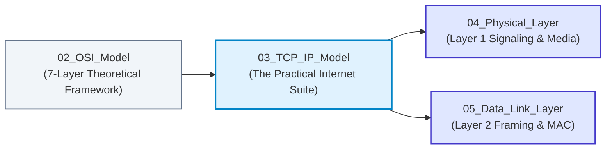

# 03. The TCP/IP Protocol Architecture

> **Master the actual protocol suite running 100% of the modern Internet: understand the 4-layer DoD vs. 5-layer hybrid stack, trace hop-by-hop packet headers across routers, and resolve classic exam protocol-placement controversies.**

| ⏱️ Time Budget | 🎯 Target Level | 📌 GATE Weight | 💼 Interview Weight |
|---|---|---|---|
| 3–4 Hours | Beginner → Intermediate | Medium (2–3 Marks: Protocol mapping, Hop traversal) | High (Core architecture, Layer boundaries, Packet journey) |

---

## 🗺️ Where This Fits

---

## 📋 Prerequisites

- [01_Fundamentals/notes.md](../01_Fundamentals/notes.md) — Topologies, delays, and packet switching.
- [02_OSI_Model/notes.md](../02_OSI_Model/notes.md) — The 7-layer framework and encapsulation principles.

---

## 🎯 What You Will Learn (Checklist)

- [ ] **DoD 4-Layer vs. Modern 5-Layer Hybrid Model:** Why academic curricula and GATE CS/IT use the 5-layer stack.
- [ ] **The Complete Protocol Suite Mapping:** IP, ARP, ICMP, IGMP, TCP, UDP, DNS, DHCP, HTTP, OSPF, BGP.
- [ ] **The Protocol Placement Matrix (Exam vs. Reality):**
  - Why ARP is encapsulated in L2 frames but operates for L3.
  - Why ICMP is encapsulated in IP packets but is a core L3 protocol.
  - Why routing protocols (OSPF, RIP, BGP) run on different transport protocols.
- [ ] **The Hop-by-Hop Packet Journey:** Exactly which fields change at every router hop (MAC rewrites, TTL decrements, IP and Port invariance).
- [ ] **IPv4 vs. IPv6 Architecture Differences:** Fixed 40-byte base header, no router fragmentation, removal of checksum.
- [ ] **TCP/IP Design Philosophy:** David Clark's principles (survivability, distributed management, fate-sharing).

---

## 📂 Files in This Module

| File | What It Gives You | Time |
|---|---|:---:|
| [notes.md](notes.md) | Comprehensive theoretical and practical notes with the protocol matrix and hop-by-hop mechanics | 60–75 min |
| [diagrams.md](diagrams.md) | 10 Mermaid architectural diagrams including the multi-hop packet journey and Wireshark dissection | 25–30 min |
| [mcqs.md](mcqs.md) | 55 balanced practice questions (30 MCQs, 10 MSQs, 10 NATs, 5 Scenario challenges) | 45–60 min |
| [interview_qa.md](interview_qa.md) | Top 20 TCP/IP interview questions with rapid-fire and deep architectural answers | 25–30 min |
| [cheatsheet.md](cheatsheet.md) | One-page printable summary of protocol layer locations, port numbers, and header invariance | 10–15 min |

---

## ⬅️ Navigation
- **Previous:** [02_OSI_Model](../02_OSI_Model/README.md)
- **Next:** [04_Physical_Layer](../04_Physical_Layer/)
