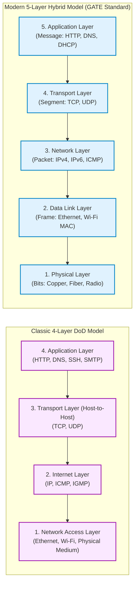
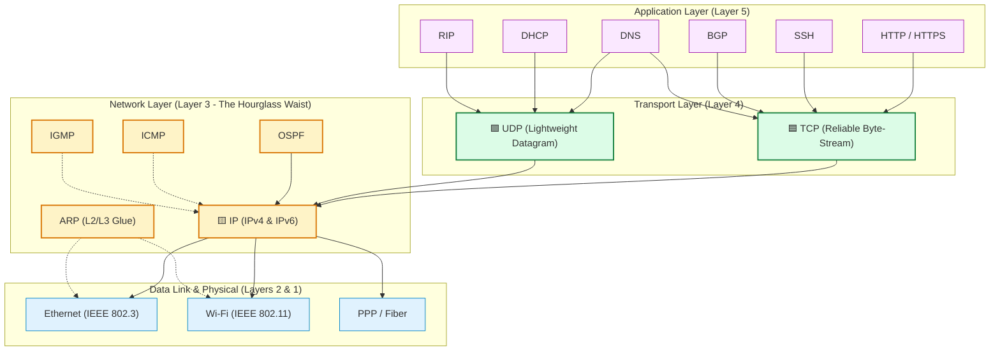
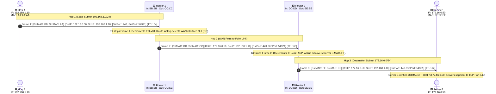
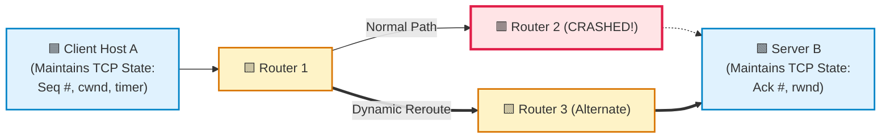
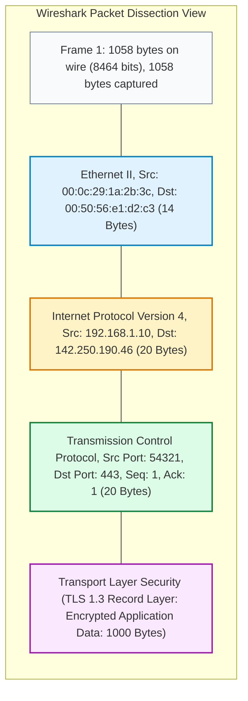
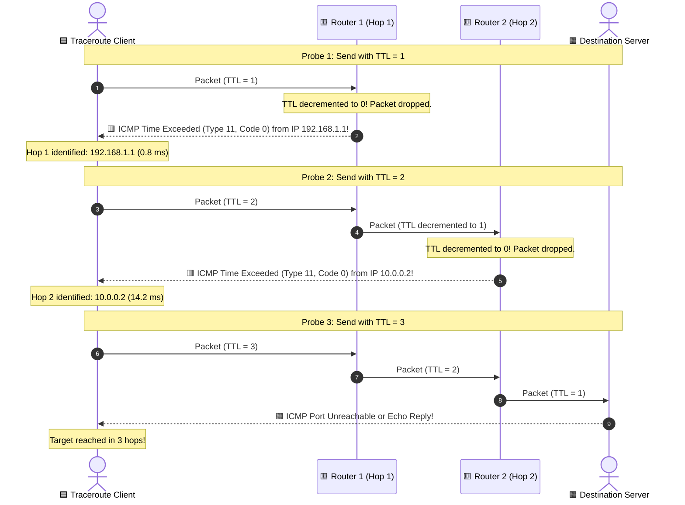
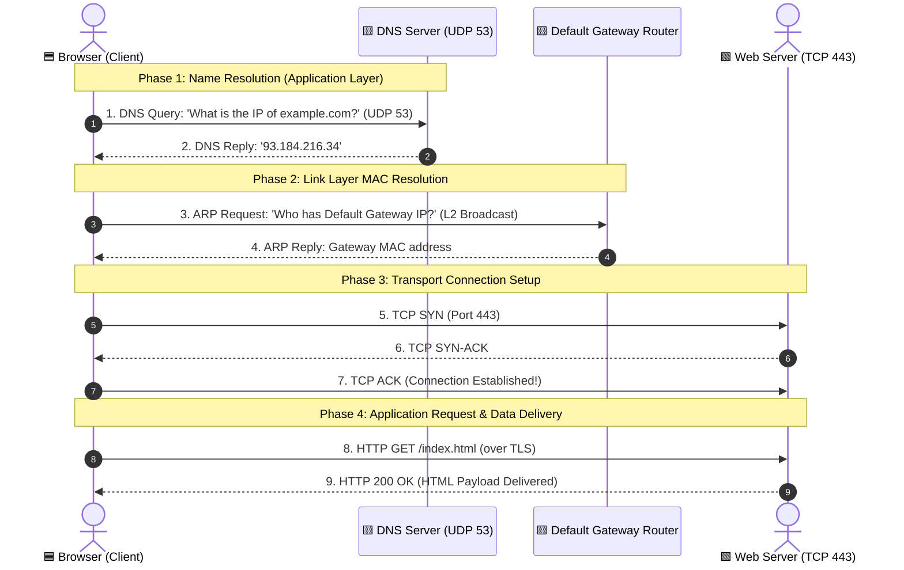
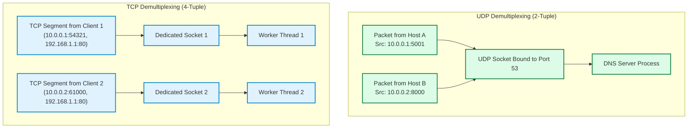

# 03. The TCP/IP Protocol Architecture — Visual Diagram Guide

> **Visual companion to Module 03.**  
> Contains 10 detailed Mermaid diagrams illustrating the 4-layer vs. 5-layer stacks, protocol placement architecture, hop-by-hop router traversals, Wireshark frame dissection, and TTL traceroute mechanics.

---

## 1. TCP/IP 4-Layer DoD vs. 5-Layer Hybrid Model

> **What to notice:** The modern 5-layer hybrid model splits the monolithic "Network Access" layer into separate Data Link (L2) and Physical (L1) layers, reflecting real-world engineering.



**How to read it:**
- The 4-layer DoD model was the historical standard (RFC 1122).
- Academic textbooks and GATE exams use the 5-layer hybrid model because hardware transceivers (L1) are physically distinct from MAC controllers (L2).

---

## 2. Complete Protocol Suite Architecture

> **What to notice:** The Internet Protocol (IP) sits at the center ("the hourglass waist"). All upper protocols funnel into IP; all lower media support IP.



**How to read it:**
- **The Hourglass Concept:** There are hundreds of application protocols and dozens of physical media, but only **one** Internet Protocol uniting them.

---

## 3. Hop-by-Hop Packet Journey Across 3 Routers

> **What to notice:** MAC addresses are completely rewritten at every hop; Source and Destination IP addresses and Port numbers remain completely invariant.



**How to read it:**
- **Source & Destination IP:** `192.168.1.10` and `172.16.0.50` never change.
- **Source & Destination Ports:** `54321` and `443` never change.
- **Source & Destination MACs:** Change on every single link (AA $\rightarrow$ BB, CC $\rightarrow$ DD, EE $\rightarrow$ FF).
- **TTL:** Decrements from 64 $\rightarrow$ 63 $\rightarrow$ 62.

---

## 4. The Fate-Sharing Architectural Model

> **What to notice:** Intermediate routers hold zero session state. If Router 2 crashes, Router 1 simply diverts packets to Router 3 without disconnecting the TCP session.



**How to read it:**
- Because routers are **stateless packet forwarders**, network failures do not terminate application connections. Endpoints handle retransmissions.

---

## 5. Wireshark-Style Layered Packet Dissection

> **What to notice:** Every packet on the wire consists of nested headers. Wireshark displays them from outer (physical/link) to inner (application).



**How to read it:**
- Blue is Layer 2 Ethernet; amber is Layer 3 IP; green is Layer 4 TCP; purple is Layer 7 Application/TLS.

---

## 6. How Traceroute Uses TTL Decrement and ICMP Time Exceeded

> **What to notice:** Traceroute deliberately forces routers to drop packets by setting TTL starting from 1, mapping every hop along the route.



**How to read it:**
- Every router that drops a packet due to $\text{TTL} = 0$ is obligated by RFC 792 to notify the sender via an ICMP Time Exceeded packet, revealing its own IP address.

---

## 7. Address Resolution Protocol (ARP) Request & Reply

> **What to notice:** The ARP Request is an Ethernet broadcast (`FF:FF:FF:FF:FF:FF`) heard by all local nodes; the ARP Reply is a direct unicast.

```mermaid
flowchart TD
    subgraph LAN["Local Broadcast Domain (Subnet 192.168.1.0/24)"]
        HostA["🟦 Host A<br/>IP: 192.168.1.10<br/>MAC: AA:AA:AA"]
        SW(("🟪 Layer 2 Switch"))
        HostB["🟩 Host B<br/>IP: 192.168.1.20<br/>MAC: BB:BB:BB"]
        HostC["Host C<br/>IP: 192.168.1.30<br/>MAC: CC:CC:CC"]
    end

    HostA -->|1. ARP Request: 'Who has 192.168.1.20?'<br/>DstMAC: FF:FF:FF:FF:FF:FF (Broadcast)| SW
    SW -->|Floods Broadcast| HostB
    SW -->|Floods Broadcast| HostC
    HostC -->|Ignores: Not my IP| HostC
    HostB -->|2. ARP Reply: 'I have 192.168.1.20, my MAC is BB:BB:BB'<br/>DstMAC: AA:AA:AA (Unicast)| SW
    SW -->|Forwards Unicast| HostA

    classDef hostA fill:#e0f2fe,stroke:#0284c7,stroke-width:2px;
    classDef hostB fill:#dcfce7,stroke:#15803d,stroke-width:2px;
    classDef sw fill:#fae8ff,stroke:#a21caf,stroke-width:2px;
    classDef hostC fill:#f8fafc,stroke:#64748b,stroke-width:1px;

    class HostA hostA;
    class HostB hostB;
    class SW sw;
    class HostC hostC;
```

**How to read it:**
- Host A caches Host B's MAC address in its ARP cache (`arp -a`) for future transmissions.

---

## 8. IPv4 Header vs. IPv6 Header Architecture

> **What to notice:** IPv6 has a clean, fixed 40-byte header. Checksum and router fragmentation fields were removed to accelerate ASIC processing.

```mermaid
flowchart TD
    subgraph IPv4["IPv4 Header (Variable: 20–60 Bytes)"]
        V4["Version (4b) | IHL (4b) | DSCP (6b) | ECN (2b) | Total Length (16b)"]
        ID["Identification (16b) | Flags (3b) | Fragment Offset (13b)"]
        TTL["Time to Live (8b) | Protocol (8b) | Header Checksum (16b)"]
        IP4_S["Source IPv4 Address (32 bits / 4 Bytes)"]
        IP4_D["Destination IPv4 Address (32 bits / 4 Bytes)"]
        OPT["Options (0–40 Bytes, variable padding)"]
        V4 --- ID --- TTL --- IP4_S --- IP4_D --- OPT
    end

    subgraph IPv6["IPv6 Header (Strictly Fixed: 40 Bytes)"]
        V6["Version (4b) | Traffic Class (8b) | Flow Label (20 bits)"]
        LEN["Payload Length (16b) | Next Header (8b) | Hop Limit (8b)"]
        IP6_S["Source IPv6 Address (128 bits / 16 Bytes)"]
        IP6_D["Destination IPv6 Address (128 bits / 16 Bytes)"]
        V6 --- LEN --- IP6_S --- IP6_D
    end

    classDef v4 fill:#fef3c7,stroke:#d97706,stroke-width:2px;
    classDef v6 fill:#e0f2fe,stroke:#0284c7,stroke-width:2px;

    class V4,ID,TTL,IP4_S,IP4_D,OPT v4;
    class V6,LEN,IP6_S,IP6_D v6;
```



**How to read it:**
- Notice the simplicity of IPv6: 8 fields vs. 14 in IPv4. Routers parse IPv6 in hardware with significantly lower CPU overhead.

---

## 9. The Complete URL Loading Lifecycle Across Protocols

> **What to notice:** A single web page request triggers four distinct protocols (DNS, ARP, TCP, HTTP) before the first byte of HTML renders.



**How to read it:**
- If any one of these four phases fails, the user experiences a broken web page.

---

## 10. Connection-Oriented (TCP) vs. Connectionless (UDP) Demultiplexing

> **What to notice:** UDP demultiplexes using a 2-tuple (Dest IP, Dest Port); TCP demultiplexes using a full 4-tuple (Src IP, Src Port, Dst IP, Dst Port).



**How to read it:**
- Two different TCP clients connecting to port 80 are routed to two separate operating system sockets because their Source IP/Port differs.
