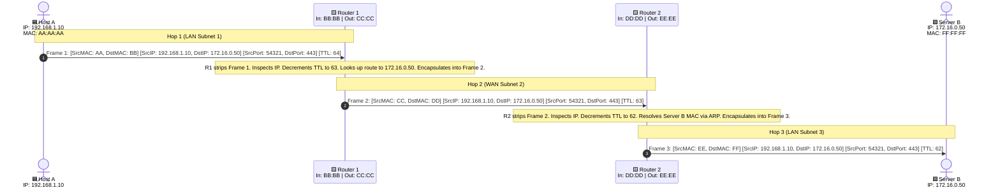

# The TCP/IP Protocol Architecture

> **Module 03: The 4-Layer DoD vs. 5-Layer Hybrid Models, Protocol Matrix, Hop-by-Hop Packet Traversal, and IPv4/IPv6 Stack Comparison**  
> *"The OSI Model is a magnificent theoretical cathedral; TCP/IP is the steel, asphalt, and concrete bridge upon which the entire modern digital economy drives."*

---

## 1. Why the TCP/IP Model Exists

### 1.1 Origins: Military Robustness & The Principle of "Fate-Sharing"
In the late 1960s, the U.S. Department of Defense's Advanced Research Projects Agency (DARPA) funded research into packet-switching networks. The primary design goal was **military survivability**:
- If nuclear strikes or natural disasters wiped out intermediate switches and transmission lines, surviving nodes on the network had to dynamically discover alternate routes without human intervention.
- The state of a communication session had to reside **exclusively at the end systems (endpoints)**, never in intermediate network routers. This design philosophy is known as **Fate-Sharing**: if an intermediate router crashes, active sessions do not die; they simply reroute around the failure.

In 1981, Vint Cerf and Bob Kahn finalized the protocol specifications in **RFC 791 (IPv4)** and **RFC 793 (TCP)**. On January 1, 1983 ("Flag Day"), ARPANET permanently turned off NCP and migrated to TCP/IP, giving birth to the modern Internet.

### 1.2 Real-World Analogy: The Global Courier System
Think of TCP/IP communication like a modern international shipping supply chain:
- **Application Layer:** You write an order on an e-commerce website for a laptop (the useful business payload).
- **Transport Layer:** You select delivery type:
  - **TCP (Registered Courier):** Tracking numbers, signature upon arrival, insurance, and re-delivery if a box is damaged.
  - **UDP (Standard Postcard):** Cheap, unacknowledged, fast broadcast.
- **Internet / Network Layer:** The logistics company looks only at the recipient's country and postal code, choosing which distribution hubs to route the box through.
- **Network Access / Link Layer:** The local van driver delivers the physical box from the regional hub to your specific front door.

---

## 2. The 4-Layer DoD Model vs. The 5-Layer Hybrid Model

Historically, the original DARPA specification defined a **4-layer model** (the DoD Model). However, modern computer science textbooks (Kurose & Ross, Tanenbaum, Forouzan) and the **GATE CS/IT examination syllabus** map the Internet using a **5-layer hybrid architecture** that cleanly separates the physical hardware from the link framing protocol:

```
┌─────────────────────────────────┐      ┌─────────────────────────────────┐
│     OSI 7-LAYER MODEL           │      │   TCP/IP 4-LAYER (DoD MODEL)    │
├─────────────────────────────────┤      ├─────────────────────────────────┤
│  7. Application                 │      │                                 │
│  6. Presentation                │───▶  │  4. Application Layer           │
│  5. Session                     │      │     (HTTP, DNS, SMTP, SSH)      │
├─────────────────────────────────┤      ├─────────────────────────────────┤
│  4. Transport                   │───▶  │  3. Transport Layer (Host-to-Host)
│                                 │      │     (TCP, UDP)                  │
├─────────────────────────────────┤      ├─────────────────────────────────┤
│  3. Network                     │───▶  │  2. Internet Layer              │
│                                 │      │     (IPv4, IPv6, ICMP)          │
├─────────────────────────────────┤      ├─────────────────────────────────┤
│  2. Data Link                   │───▶  │  1. Network Access / Link Layer │
│  1. Physical                    │      │     (Ethernet, Wi-Fi, Hardware) │
└─────────────────────────────────┘      └─────────────────────────────────┘

                            ▼
      ┌────────────────────────────────────────────────────────┐
      │   MODERN 5-LAYER HYBRID MODEL (GATE CS/IT STANDARD)    │
      ├────────────────────────────────────────────────────────┤
      │  5. Application Layer  (Message: HTTP, DNS, DHCP)      │
      ├────────────────────────────────────────────────────────┤
      │  4. Transport Layer    (Segment: TCP / UDP)            │
      ├────────────────────────────────────────────────────────┤
      │  3. Network Layer      (Packet: IPv4 / IPv6 / ICMP)    │
      ├────────────────────────────────────────────────────────┤
      │  2. Data Link Layer    (Frame: Ethernet / Wi-Fi MAC)   │
      ├────────────────────────────────────────────────────────┤
      │  1. Physical Layer     (Bits: Voltage / Fiber Light)   │
      └────────────────────────────────────────────────────────┘
```

### PDUs Across the 5-Layer Stack
1. **Layer 5 (Application):** **Message** (Raw application request/response stream).
2. **Layer 4 (Transport):** **Segment** (for TCP) / **User Datagram** (for UDP).
3. **Layer 3 (Network):** **Datagram** or **Packet**.
4. **Layer 2 (Data Link):** **Frame**.
5. **Layer 1 (Physical):** **Bits** ($0\text{s}$ and $1\text{s}$).

---

## 3. The Protocol-to-Layer Matrix: Exam Answers vs. Technical Reality

A frequent source of confusion in university and competitive exams is where specific protocols belong. Protocols often rely on one layer while servicing another:

| Protocol | Full Name | Academic / GATE Exam Answer | Real-World Implementation Reality | Architectural Explanation |
|---|---|:---:|:---:|---|
| **ARP** | Address Resolution Protocol | **Network Layer (Layer 3)** | Encapsulated directly inside **Layer 2 Ethernet frames** (EtherType `0x0806`). | In practice sits between L2 and L3. ARP does not use IP headers; it is an L2 broadcast message whose sole purpose is to resolve an L3 IPv4 address to an L2 MAC address. |
| **RARP** | Reverse Address Resolution Protocol | **Network Layer (Layer 3)** | Encapsulated inside **Layer 2 Ethernet frames** (EtherType `0x8035`). | Legacy protocol replaced by BOOTP/DHCP; maps physical MAC back to logical IPv4. |
| **ICMP** | Internet Control Message Protocol | **Network Layer (Layer 3)** | Encapsulated inside **IPv4 packets** (IP Protocol `1`). | Even though ICMP is wrapped inside an IP packet just like TCP or UDP, it is an integral companion to IP for error reporting and diagnostics (`ping`, `traceroute`). |
| **IGMP** | Internet Group Management Protocol | **Network Layer (Layer 3)** | Encapsulated inside **IPv4 packets** (IP Protocol `2`). | Used by hosts and adjacent routers to establish multicast group memberships. |
| **OSPF** | Open Shortest Path First | **Network Layer (Layer 3)** | Encapsulated directly in **IP packets** (IP Protocol `89`). | An interior gateway routing protocol. It bypasses TCP and UDP entirely to calculate shortest path trees. |
| **BGP** | Border Gateway Protocol | **Application Layer (Layer 7 / 5)** | Runs over **TCP port 179**. | Connects global autonomous systems. Functionally an L3 path-vector routing protocol, but implemented at the Application Layer over a TCP transport connection. |
| **RIP** | Routing Information Protocol | **Application Layer (Layer 7 / 5)** | Runs over **UDP port 520**. | Functionally an L3 distance-vector routing protocol, but implemented at the Application Layer over UDP datagrams. |
| **DHCP** | Dynamic Host Configuration Protocol | **Application Layer (Layer 7 / 5)** | Runs over **UDP ports 67 (server) & 68 (client)**. | Although DHCP assigns Layer 3 IP configuration, it executes as an application-level client-server protocol. |
| **DNS** | Domain Name System | **Application Layer (Layer 7 / 5)** | Runs over **UDP & TCP port 53**. | Resolves human-readable domain names to IP addresses. |

> **🎯 Exam Tip: How to Answer in GATE vs. Interviews ("Exam Answer First, Real-World Note Second"):**  
> - If an exam asks: *"At which layer does ARP / RARP operate?"* $\rightarrow$ Answer **Network Layer (Layer 3)** (Add note: in practice it sits between L2 and L3).  
> - If an exam asks: *"At which layer does ICMP / IGMP / OSPF operate?"* $\rightarrow$ Answer **Network Layer (Layer 3)**.  
> - If an exam asks: *"At which layer does BGP operate?"* $\rightarrow$ Answer **Application Layer** (runs over TCP port 179; functionally path-vector routing).  
> - If an exam asks: *"At which layer does RIP operate?"* $\rightarrow$ Answer **Application Layer** (runs over UDP port 520; functionally distance-vector routing).  
> - If an exam asks: *"What layer devices are routers, switches, and hubs?"* $\rightarrow$ Answer **Router = Layer 3 device, Switch = Layer 2 device, Hub = Layer 1 device**.

---

## 4. End-to-End Packet Journey: Header Evolution Across 3 Routers

Consider a user at **Host A** loading a web page from **Server B** across two intermediate routers:

```
[ Host A ] ────────── [ Router 1 ] ────────── [ Router 2 ] ────────── [ Server B ]
192.168.1.10           In: 192.168.1.1         In: 10.0.0.2            172.16.0.50
MAC: AA:AA:AA          MAC: BB:BB:BB           MAC: DD:DD:DD           MAC: FF:FF:FF
                       Out: 10.0.0.1           Out: 172.16.0.1
                       MAC: CC:CC:CC           MAC: EE:EE:EE
   (Subnet 1)                 (Subnet 2: WAN)                 (Subnet 3)
```

### What Changes and What Stays the Same?



### The Golden Invariance Rule
1. **Layer 2 (MAC Addresses):** **Rewritten at EVERY single router hop.** The source MAC is always the egress interface of the forwarding router; the destination MAC is always the ingress interface of the next-hop router.
2. **Layer 3 (IP Addresses):** **Remain CONSTANT from source to destination** (unless traversing a NAT/PAT router).
3. **Layer 4 (Port Numbers):** **Remain CONSTANT from source to destination** (unless modified by PAT).
4. **Time-to-Live (TTL):** **Decremented by 1 at every router hop.** When $\text{TTL} = 0$, the router drops the packet and returns an ICMP Time Exceeded message (`Type 11, Code 0`) to Host A (this is how `traceroute` works).

---

## 5. IPv4 vs. IPv6 Protocol Stack Architecture

The rapid exhaustion of the 32-bit IPv4 address space led to the design of **IPv6 (RFC 8200)**. IPv6 is not merely longer addresses; it introduced foundational architectural simplifications:

| Architectural Feature | IPv4 Protocol Stack | IPv6 Protocol Stack | Engineering Rationale |
|---|---|---|---|
| **Address Length** | **32 bits** ($\approx 4.29 \times 10^9$ addresses) | **128 bits** ($\approx 3.4 \times 10^{38}$ addresses) | Eliminates address exhaustion forever; allows every device on Earth to have a public IP. |
| **Base Header Size** | **Variable (20 to 60 Bytes)** | **Fixed (40 Bytes)** | Fixed header enables fast hardware parsing in router ASICs at line rate. |
| **Header Checksum** | **Present (16 bits)** | **Removed entirely** | In modern networks, L2 (Ethernet CRC) and L4 (TCP/UDP checksum) already check errors; recalculating checksum at every router hop wasted CPU. |
| **Router Fragmentation** | **Supported** (Routers fragment packets if size exceeds link MTU) | **Forbidden** (Routers drop and return ICMPv6 "Packet Too Big") | Forcing sending hosts to perform **Path MTU Discovery (PMTUD)** eliminates heavy fragmentation buffering in router memory. |
| **Address Resolution** | **ARP** (L2 broadcast messages) | **Neighbor Discovery Protocol (NDP)** | Replaces noisy broadcast storms with targeted ICMPv6 multicast messages. |
| **Broadcast Addresses** | **Yes** (e.g. `255.255.255.255`) | **No broadcast** (Replaced by Multicast & Anycast) | Prevents network-wide interruptions from broadcast storms. |
| **Address Autoconfiguration** | DHCP or manual static IP | **SLAAC (Stateless Address Autoconfiguration)** | Devices generate their own global IPv6 address automatically using router advertisements. |

---

## 6. End-to-End Walkthrough: What Happens When You Load a Web Page?

When a user opens a web browser and navigates to `https://www.google.com`, the entire TCP/IP stack executes this precise sequence:

1. **Application Layer (DNS Resolution):**
   - The browser needs the server's IP address. It checks local cache, then OS cache, then dispatches a **DNS query (UDP port 53)** to the configured resolver (e.g., `8.8.8.8`).
   - The DNS resolver returns Google's IP: `142.250.190.46`.
2. **Network Layer (ARP Resolution):**
   - Host A checks its local subnet mask. `142.250.190.46` is on a remote network. Host A must forward the packet to its **Default Gateway** (router).
   - If the router's MAC address is not in Host A's ARP table, Host A broadcasts an **ARP Request** (`Who has 192.168.1.1? Tell 192.168.1.10`).
   - The router unicasts an **ARP Reply** with its MAC address.
3. **Transport Layer (TCP 3-Way Handshake):**
   - Host A initiates a reliable connection by sending a **SYN** packet to port 443 with an initial sequence number ($ISN_A$).
   - Google's server responds with **SYN-ACK** ($ISN_B, \text{ACK} = ISN_A + 1$).
   - Host A replies with **ACK** ($\text{ACK} = ISN_B + 1$). Connection is now `ESTABLISHED`.
4. **Security Sublayer (TLS 1.3 Handshake):**
   - Host A sends `ClientHello` with supported cryptographic cipher suites.
   - Server responds with `ServerHello`, presents its X.509 digital certificate, and completes an ephemeral Diffie-Hellman key exchange. Symmetric AES session keys are generated.
5. **Application Layer (HTTP Request & Response):**
   - Host A sends an encrypted `HTTP GET /` request.
   - Google responds with `200 OK` containing HTML, CSS, and JavaScript.
6. **Teardown (TCP 4-Way Handshake):**
   - Connection is closed cleanly using `FIN` and `ACK` packets in both directions.

---

## 7. Exam & Interview Insights

### Classic Interview Questions
1. **"Does ping use TCP or UDP?"**
   - *Answer:* **Neither.** Ping uses **ICMP (Internet Control Message Protocol)** directly encapsulated inside an IP datagram (IP Protocol `1`). It does not use transport-layer port numbers.
2. **"Why does traceroute display router IP addresses along a path?"**
   - *Answer:* Traceroute sends packets with incremental TTL values ($\text{TTL} = 1, 2, 3\dots$). When a router receives a packet with $\text{TTL} = 1$, it decrements it to $0$, drops the packet, and sends back an **ICMP Time Exceeded** packet. The source IP of that ICMP packet reveals the router's identity!
3. **"Why does TCP/IP not have Session and Presentation layers?"**
   - *Answer:* The IETF designers believed that data formatting, compression, encryption, and session tracking are application-specific concerns. Forcing them into rigid operating system network layers added bloat without benefit.

---

## 8. Summary

1. The TCP/IP model was designed by DARPA for military resilience based on the principle of **fate-sharing** (state lives at endpoints, not in the core).
2. The classic DoD model has 4 layers; the modern academic and GATE standard uses a **5-layer hybrid model** (Physical, Data Link, Network, Transport, Application).
3. PDU names: Message (L5), Segment (L4), Packet/Datagram (L3), Frame (L2), Bits (L1).
4. Layer boundaries have nuanced implementations: ARP is encapsulated in Layer 2 frames; ICMP is encapsulated in Layer 3 IP packets; OSPF runs on IP (Protocol 89); BGP runs on TCP (Port 179).
5. As packets cross routers, **MAC addresses are rewritten at every hop**, while **Source/Destination IP addresses and Port numbers remain constant**.
6. IPv6 eliminates router fragmentation, removes the header checksum, fixes the base header at 40 bytes, and replaces broadcast with multicast.

---

## 9. Quick Revision Checklist

- [ ] Can draw the 4-layer DoD, 5-layer Hybrid, and 7-layer OSI models side by side.
- [ ] Can trace exact header changes across 3 router hops (which change, which stay the same).
- [ ] Can state why ICMP and ARP are classified at the Network Layer despite their encapsulation.
- [ ] Know the transport protocols used by BGP (TCP 179), OSPF (IP 89), RIP (UDP 520), and DNS (UDP/TCP 53).
- [ ] Can explain why IPv6 removed the header checksum and disabled router fragmentation.

---

## ⬅️ Navigation
- **Module Overview:** [README.md](README.md)
- **Visual Diagrams:** [diagrams.md](diagrams.md)
- **Practice Questions:** [mcqs.md](mcqs.md)
- **Interview Q&A:** [interview_qa.md](interview_qa.md)
- **Next Module:** [04_Physical_Layer](../04_Physical_Layer/)
