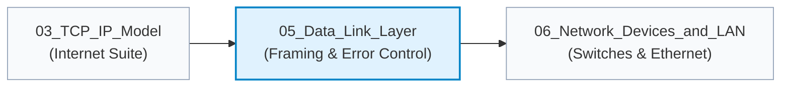

# 05. Data Link Layer

> **Master the fundamental mechanics of Layer 2 node-to-node communications: framing strategies, bit and byte stuffing, error detection algorithms (1D/2D Parity, RFC 1071 Checksum, CRC), and Hamming single-error-correcting codes.**

| ⏱️ Time Budget | 🎯 Target Level | 📌 GATE Weight | 💼 Interview Weight |
|---|---|---|---|
| 4–5 Hours | Beginner → Advanced | High (4–6 Marks in GATE CS/IT) | High (Core Framing, CRC, Ethernet FCS) |

---

## 🗺️ Where This Fits

---

## 📋 Prerequisites

- [01_Fundamentals/notes.md](../01_Fundamentals/notes.md) — Topologies, delays, and transmission modes.
- [02_OSI_Model/notes.md](../02_OSI_Model/notes.md) — Layer 2 hop-by-hop framing responsibilities.
- [03_TCP_IP_Model/notes.md](../03_TCP_IP_Model/notes.md) — Encapsulation and hop-by-hop MAC traversal.

---

## 🎯 What You Will Learn (Checklist)

### Sub-step 05a: Framing & Error Control
- [ ] **Framing Methods:** Character Count (vulnerabilities), Byte Stuffing (PPP/BISYNC byte stuffing), Bit Stuffing (HDLC 5 consecutive 1s rule), and Physical Layer Coding Violations (4B/5B, Manchester invalid states).
- [ ] **Error Detection vs Correction:** Why detection + retransmission (ARQ) dominates WAN/LAN while FEC (Forward Error Correction) is reserved for high-latency or noisy simplex links.
- [ ] **Simple & 2D Parity:** Even/odd parity math, burst detection limits in two-dimensional parity matrix.
- [ ] **RFC 1071 Internet Checksum:** 16-bit 1's complement addition, end-around carry arithmetic, and undetected transposition errors.
- [ ] **Cyclic Redundancy Check (CRC):** Modulo-2 polynomial division, Generator polynomial selection criteria ($G(x)$ properties), undetected error patterns, and hardware LFSR implementation.
- [ ] **Hamming Single-Error-Correcting Code:** Redundancy bit lower bound equation $(m + r + 1 \le 2^r)$, bit positions of powers of 2, syndrome calculation, and error localization.
- [ ] **Hamming Distance Theorems:** Minimum distance $d_{\min} \ge d + 1$ for detecting $d$ errors; $d_{\min} \ge 2t + 1$ for correcting $t$ errors; $d_{\min} \ge t + d + 1$ for simultaneous correction and detection.
- [ ] **Exam vs. Reality:** Data Link Layer guarantees vs. Ethernet silent drop of invalid FCS frames.

---

## 📂 Files in This Module

| File | What It Gives You | Time |
|---|---|:---:|
| [notes.md](notes.md) | Comprehensive deep-dive notes with theory, algorithms, equations, and exam traps | 60–75 min |
| [diagrams.md](diagrams.md) | 12 Mermaid architectural, flow, and CRC/Hamming calculation diagrams | 25–30 min |
| [numericals.md](numericals.md) | 10 solved numerical problems across 3 levels (Basic, Exam, GATE-hard) verified with Python | 40–50 min |
| [mcqs.md](mcqs.md) | 55 practice questions (30 MCQs, 10 MSQs, 10 NATs, 5 Scenarios) with balanced keys | 45–60 min |
| [interview_qa.md](interview_qa.md) | 20 high-yield interview questions with 30-second rapid summaries and deep answers | 25–35 min |
| [cheatsheet.md](cheatsheet.md) | High-yield one-page revision sheet summarizing tables, formulas, CLI diagnostics, and traps | 10–15 min |

---

## ⬅️ Navigation
- **Module Index:** [INDEX.md](../INDEX.md)
- **Previous Module:** [03_TCP_IP_Model](../03_TCP_IP_Model/README.md)
- **Next Module:** [06_Network_Devices_and_LAN](../06_Network_Devices_and_LAN/)
