# 05. Data Link Layer (Part A) — Visual Architectural Diagrams

> **12 comprehensive Mermaid diagrams illustrating framing mechanics, bit/byte stuffing, CRC division, and Hamming error correction.**

```
%% --- Shared Color Palette ---
%% Primary / Core:      fill:#e0f2fe,stroke:#0284c7,stroke-width:2px,color:#0369a1
%% Success / OK:        fill:#dcfce7,stroke:#16a34a,stroke-width:2px,color:#15803d
%% Warning / Transition: fill:#fef3c7,stroke:#d97706,stroke-width:2px,color:#b45309
%% Danger / Error:      fill:#fee2e2,stroke:#dc2626,stroke-width:2px,color:#b91c1c
%% Neutral / Secondary: fill:#f1f5f9,stroke:#64748b,stroke-width:2px,color:#334155
```

---

## 1. IEEE 802 Sublayer Architecture (LLC vs. MAC)
*Notice how the LLC sublayer decouples upper network protocols from physical media technologies.*

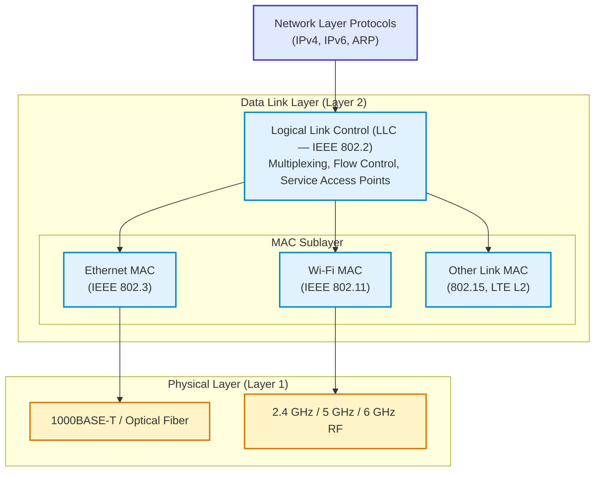

**How to Read It:**
- LLC handles logical multiplexing across diverse physical media.
- Ethernet and Wi-Fi run distinct MAC sublayers but present an identical LLC interface to IPv4/IPv6.

---

## 2. Character Count Framing Failure Cascade
*Notice how a single corrupted count byte permanently desynchronizes all subsequent frames.*

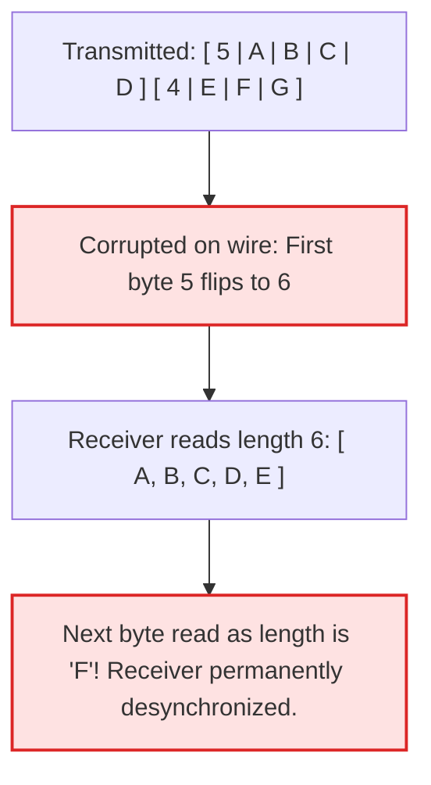

**How to Read It:**
- Character count has zero resilience against transmission errors; modern protocols use delimiter flags instead.

---

## 3. Byte Stuffing & Destuffing Pipeline
*Notice how the transmitter inserts ESC bytes to prevent data bytes from triggering frame delimiters.*

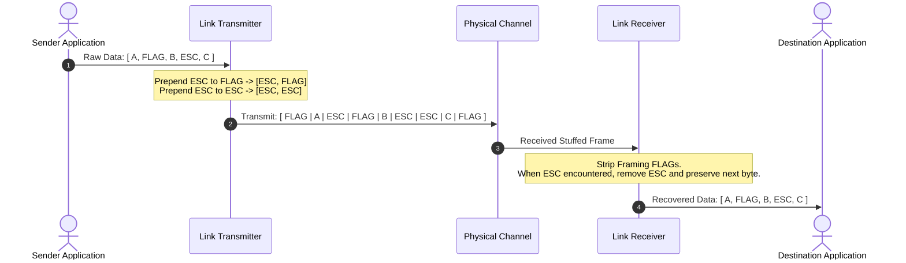

**How to Read It:**
- Escape bytes guarantee data transparency for arbitrary 8-bit binary payloads.

---

## 4. HDLC Bit Stuffing State Machine
*Notice how the hardware detects five consecutive 1s and automatically inserts a 0.*

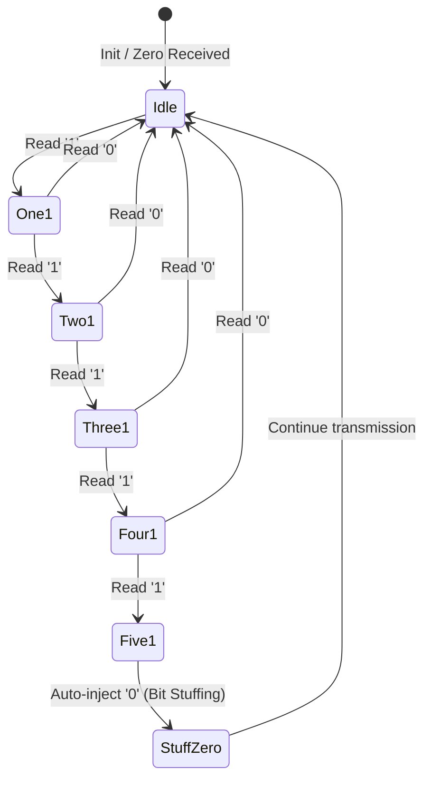

**How to Read It:**
- The pattern of six consecutive $1$s (`01111110`) is reserved exclusively for frame boundary delimiters.

---

## 5. 2-Dimensional Parity Grid Error Detection & Correction
*Notice how the intersection of row and column parity errors pinpoints the exact corrupted bit.*

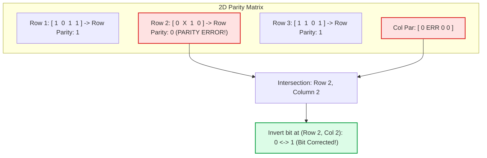

**How to Read It:**
- 2D parity detects up to 3 errors and provides single-bit forward error correction.

---

## 6. Internet Checksum Generation & Verification Flow
*Notice how end-around carry preserves carry bits in 1's complement arithmetic.*

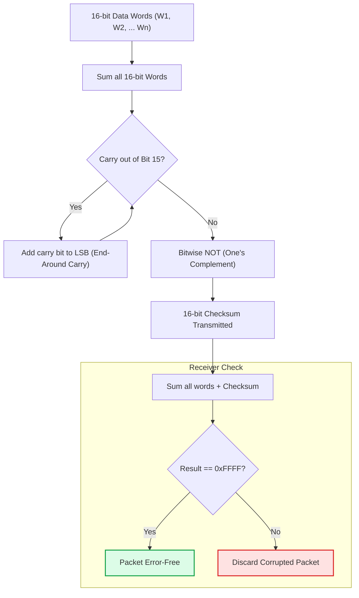

**How to Read It:**
- If no bit errors occurred, summing the data and the checksum yields all 1s (`0xFFFF`).

---

## 7. CRC Modulo-2 Polynomial Division Architecture
*Notice how polynomial division is executed entirely with XOR operations without borrows.*

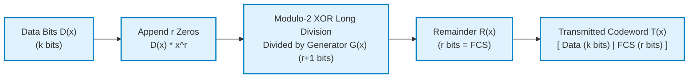

**How to Read It:**
- The degree of the generator polynomial determines the exact number of appended zero bits.

---

## 8. Hardware Linear Feedback Shift Register (LFSR) for CRC
*Notice how hardware shift registers compute 32-bit CRC at line rate using XOR gates.*

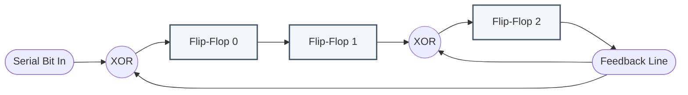

**How to Read It:**
- Tap positions correspond directly to non-zero coefficients of the generator polynomial $G(x)$.

---

## 9. Hamming Distance Geometric Codeword Sphere Model
*Notice why error correction requires twice the distance of error detection.*

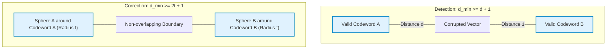

**How to Read It:**
- Error correction demands non-intersecting spheres of radius $t$ centered on valid codewords.

---

## 10. Hamming(7,4) Bit Position & Coverage Matrix
*Notice how parity bits sit at powers of 2 ($1, 2, 4$) and cover specific data bit combinations.*

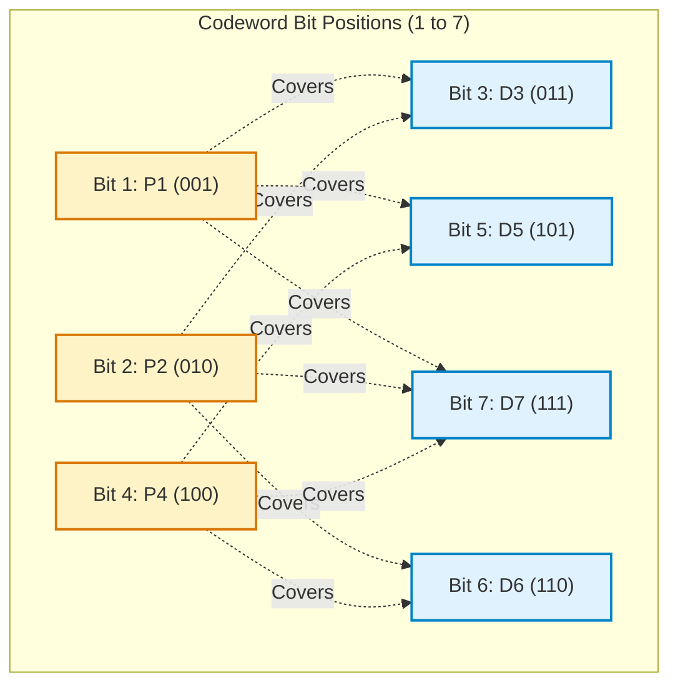

**How to Read It:**
- Data bit 7 ($111_2$) is checked by all three parity bits because $1, 2,$ and $4$ are all in its binary expansion.

---

## 11. Syndrome Decoding & Error Location Flow
*Notice how evaluating parity checks produces a binary integer pointing to the corrupted bit.*

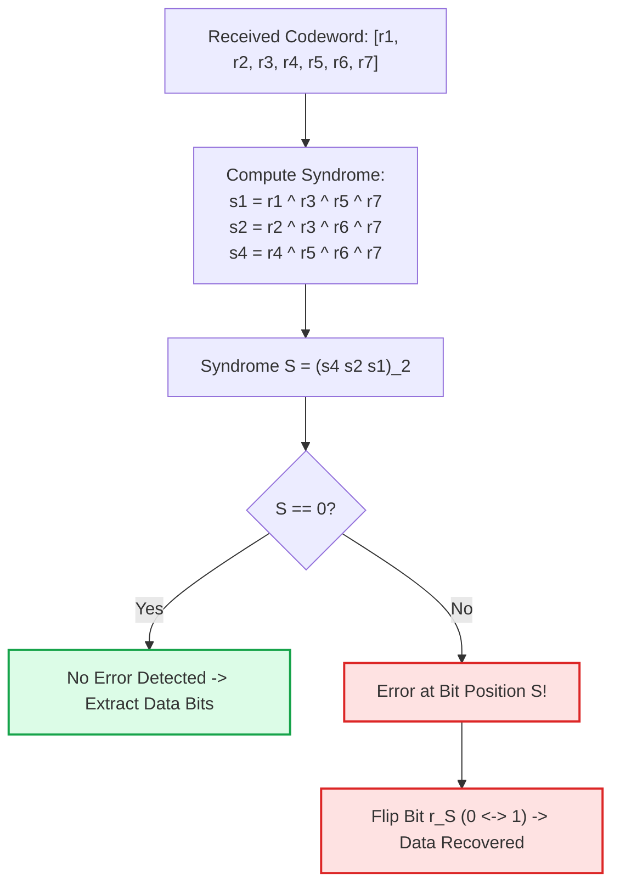

**How to Read It:**
- If $S = 5$ (`101`), bit 5 flipped during transmission. Inverting bit 5 restores the original payload.

---

## 12. Link-Layer Diagnostic Workflow for CRC Errors
*Notice the systematic physical-to-logical troubleshooting path for link-layer errors.*

```mermaid
flowchart TD
    Alert["High FCS / CRC Error Counter on Switch Port"] --> CableCheck{Replace Patch Cable?}
    CableCheck -- Fixed --> BadCable["Root Cause: Damaged RJ45 or Optical Fiber Bend"]
    CableCheck -- Persists --> DuplexCheck{Duplex Mismatch?<br/>(Half vs Full)}
    DuplexCheck -- Yes --> FixDuplex["Fix Duplex Setting on Interface"]
    DuplexCheck -- No --> CheckEMI{Near High-Voltage Motor / EMI?}
    CheckEMI -- Yes --> Shield["Install Shielded STP / Re-route Cable"]
    CheckEMI -- No --> PortASIC["Faulty Switch Port Transceiver ASIC"]

    classDef warn fill:#fef3c7,stroke:#d97706,stroke-width:2px;
    class Alert,CableCheck,DuplexCheck,CheckEMI warn;
```

**How to Read It:**
- CRC errors indicate physical layer corruption before frame processing at Layer 2.

---

## ⬅️ Navigation
- **Module Overview:** [README.md](README.md)
- **Deep-Dive Notes:** [notes.md](notes.md)
- **Solved Numericals:** [numericals.md](numericals.md)
- **Practice Questions:** [mcqs.md](mcqs.md)
- **Next Sub-step:** [05b Flow Control & ARQ](../05_Data_Link_Layer/)
