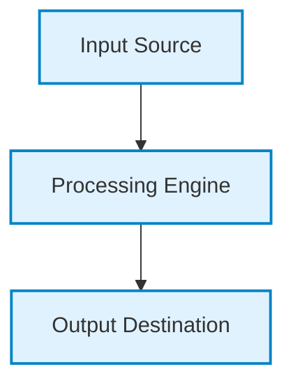
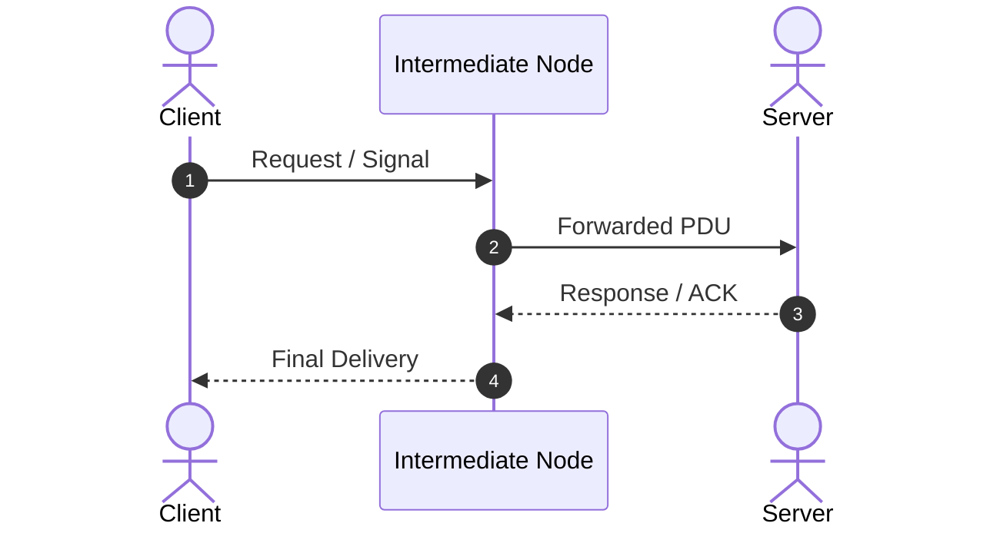
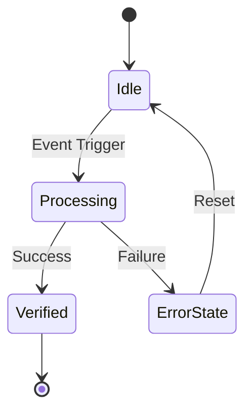
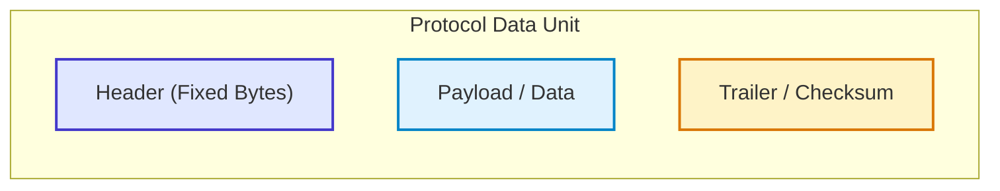
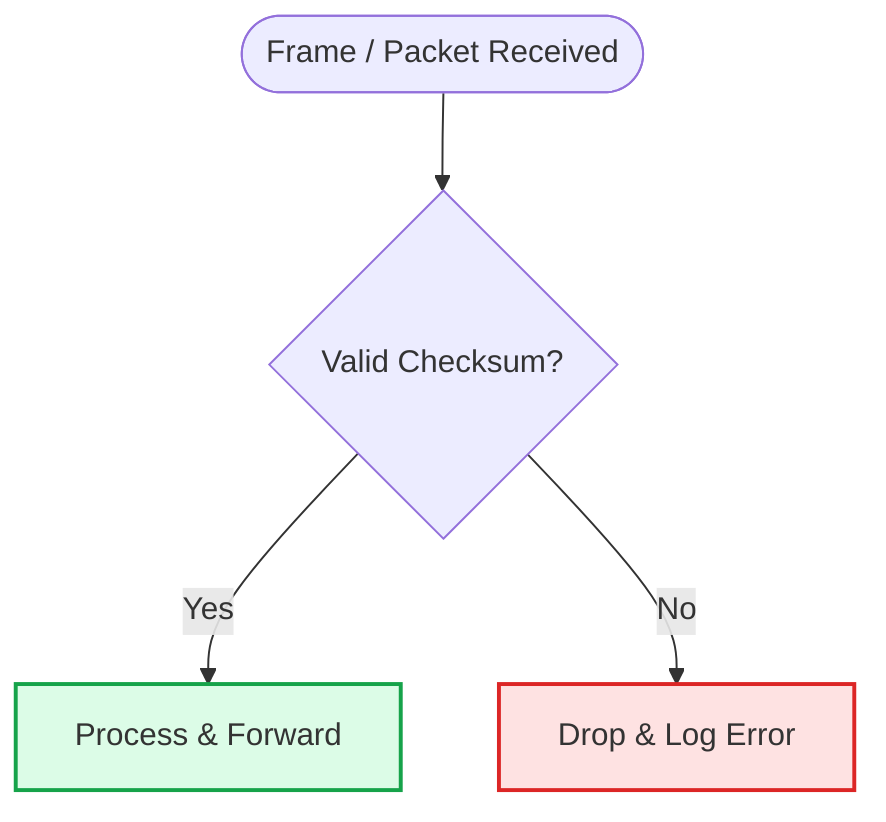
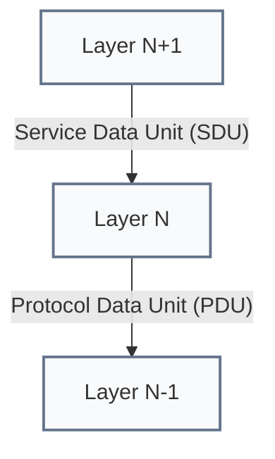
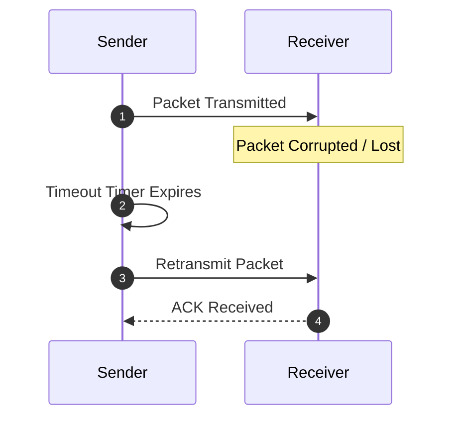
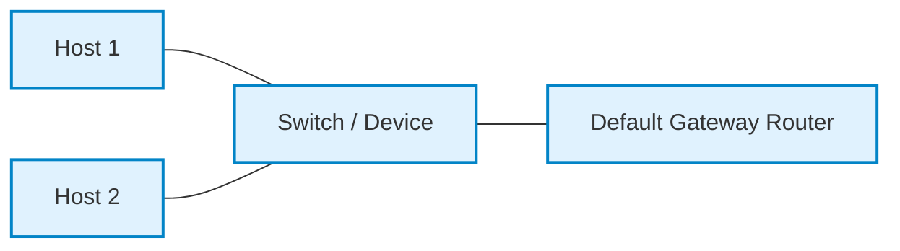
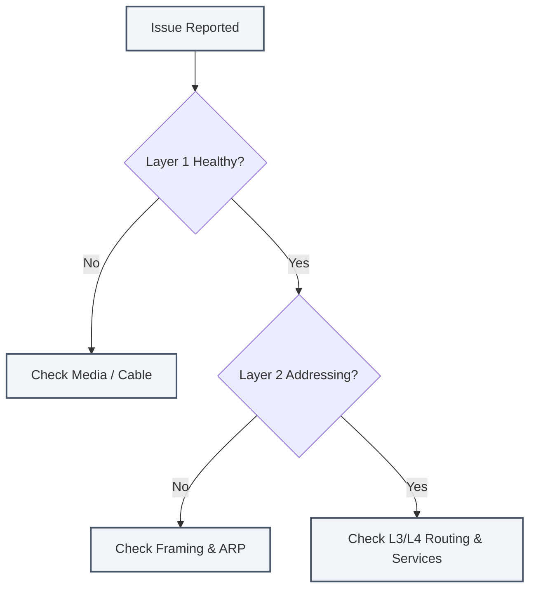

# 05. Data Link Layer — Visual Architectural Diagrams

> **10 comprehensive Mermaid diagrams illustrating workflows, frame structures, state machines, and interactions.**

```
%% --- Shared Color Palette ---
%% Primary / Core:      fill:#e0f2fe,stroke:#0284c7,stroke-width:2px,color:#0369a1
%% Success / OK:        fill:#dcfce7,stroke:#16a34a,stroke-width:2px,color:#15803d
%% Warning / Transition: fill:#fef3c7,stroke:#d97706,stroke-width:2px,color:#b45309
%% Danger / Error:      fill:#fee2e2,stroke:#dc2626,stroke-width:2px,color:#b91c1c
%% Neutral / Secondary: fill:#f1f5f9,stroke:#64748b,stroke-width:2px,color:#334155
```

---

## 1. High-Level Architecture & Context



---

## 2. End-to-End Protocol Flow



---

## 3. Protocol State Machine



---

## 4. Header & Frame Layout



---

## 5. Decision & Processing Logic



---

## 6. Interaction with Adjacent Layers



---

## 7. Timing & Latency Breakdown

```mermaid
gantt
    title Packet Transmission & Propagation Timeline
    dateFormat X
    axisFormat %s ms
    section Sender
    Transmission Delay (L/R) :0, 10
    section Media
    Propagation Delay (d/v)  :10, 30
    section Receiver
    Processing & Queuing     :30, 35
```



---

## 8. Failure & Recovery Sequence



---

## 9. Topology / Deployment Mapping



---

## 10. Diagnostic & Troubleshooting Workflow



---

## ⬅️ Navigation
- **Module Overview:** [README.md](README.md)
- **Deep-Dive Notes:** [notes.md](notes.md)
- **Practice Questions:** [mcqs.md](mcqs.md)
- **Next Module:** [06_Network_Devices_and_LAN](../06_Network_Devices_and_LAN/README.md)
