# 05b. Flow Control & ARQ — Visual Diagram Suite

> **13 High-Yield Architectural and Timeline Sequence Diagrams illustrating normal flows, failure modes, lost frame/ACK recoveries, sliding window mechanics, and window overlap proofs.**

---

## 1. Stop-and-Wait ARQ: Normal Error-Free Flow

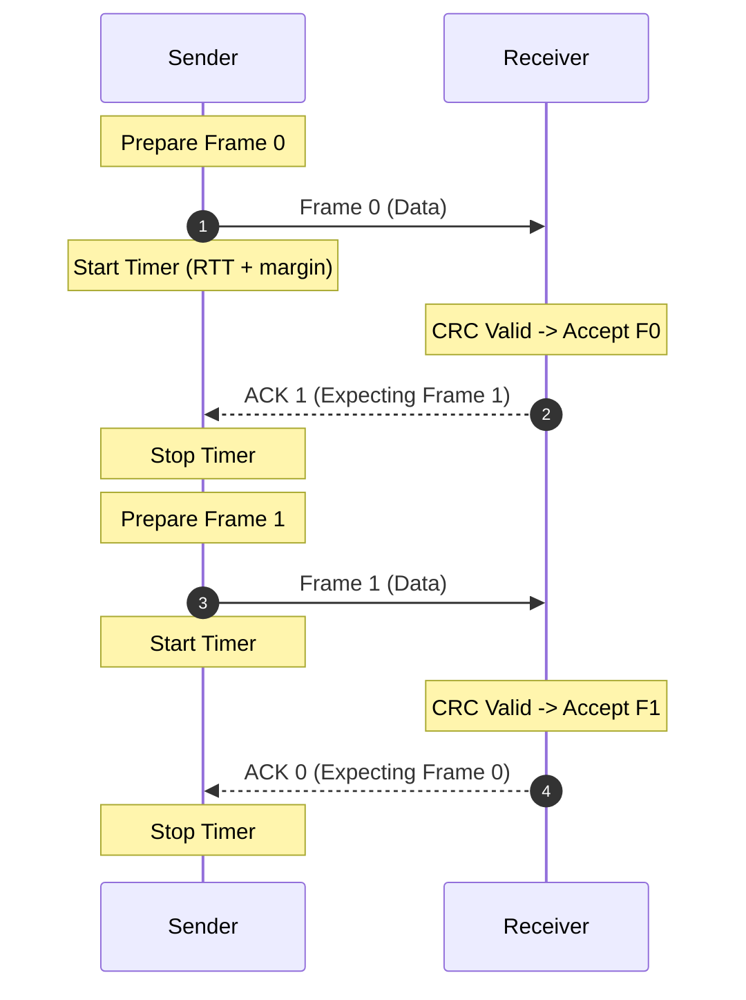

> **What to notice:**
> - Alternating sequence numbers $0$ and $1$ are sufficient for Stop-and-Wait.
> - The transmitter must remain completely idle for the entire round-trip propagation time ($2T_p$) between each frame.

---

## 2. Stop-and-Wait ARQ: Lost Data Frame Scenario

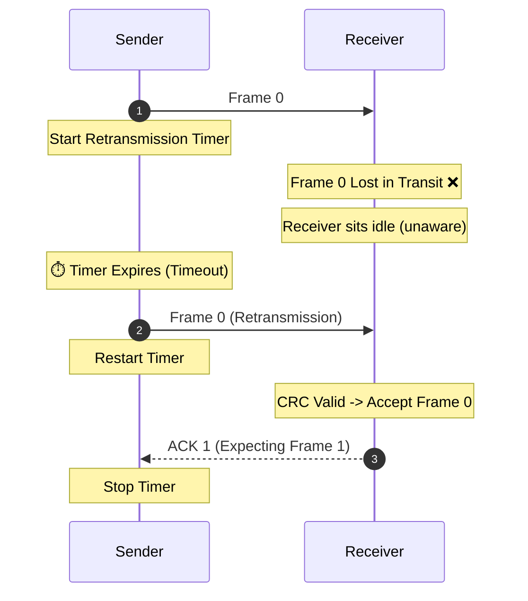

> **What to notice:**
> - The receiver never sends a negative acknowledgment for an unreceived frame because it has no knowledge that a transmission occurred.
> - Recovery depends entirely on sender-side timer expiration.

---

## 3. Stop-and-Wait ARQ: Lost ACK Scenario

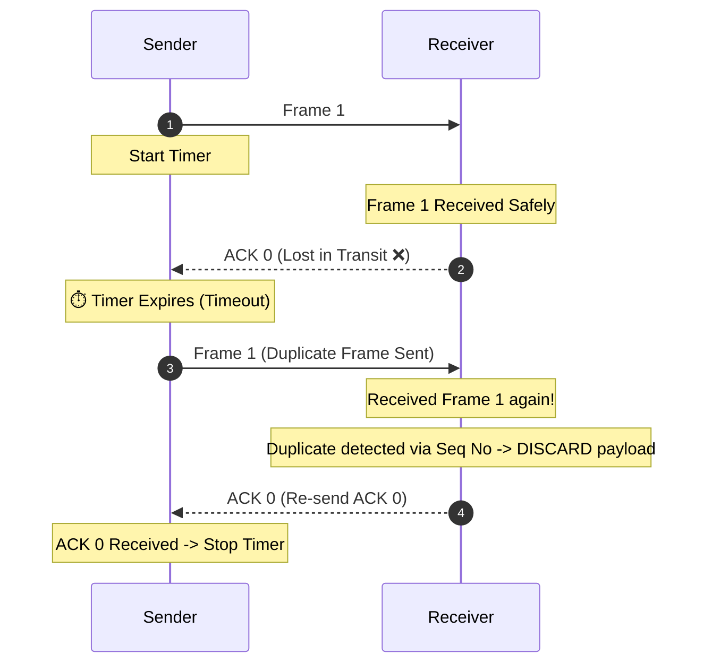

> **What to notice:**
> - The receiver must not deliver duplicate data to the network layer.
> - The receiver retransmits the acknowledgment to unblock the sender.

---

## 4. Stop-and-Wait ARQ: Delayed ACK / Premature Timeout

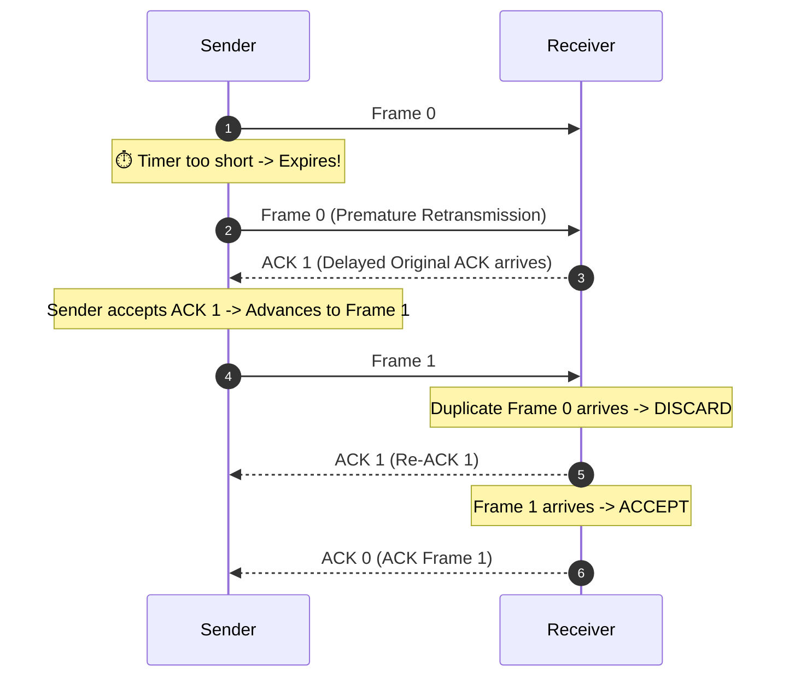

> **What to notice:**
> - If timeout timers are set too aggressively, duplicate packets flood the link.
> - Sequence numbers prevent duplicate data from corrupting the stream.

---

## 5. Go-Back-N (GBN) ARQ: Normal Continuous Pipelined Flow ($W_s = 4$)

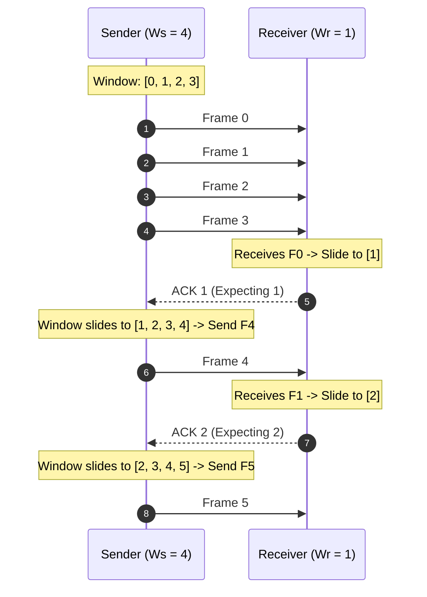

> **What to notice:**
> - The transmitter pipelines up to $W_s$ frames continuously without waiting for individual ACKs.
> - Receiver window $W_r = 1$ advances one frame at a time.

---

## 6. Go-Back-N (GBN) ARQ: Lost Frame & Cascading Discard

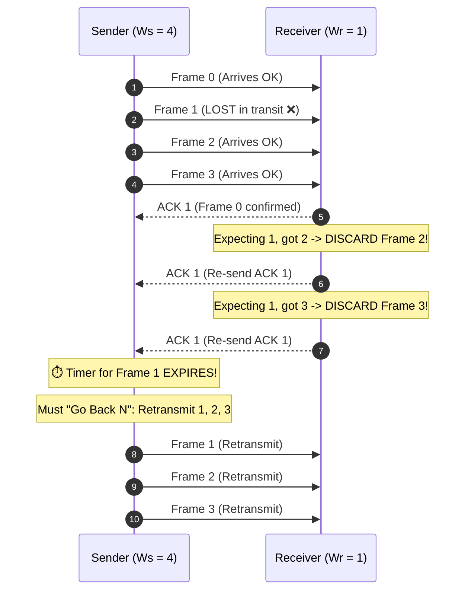

> **What to notice:**
> - Even though Frames 2 and 3 arrived completely undamaged, the receiver discarded them because $W_r = 1$.
> - All unacknowledged frames must be retransmitted, causing severe throughput loss on high-error links.

---

## 7. Go-Back-N (GBN) ARQ: Cumulative ACK Tolerance

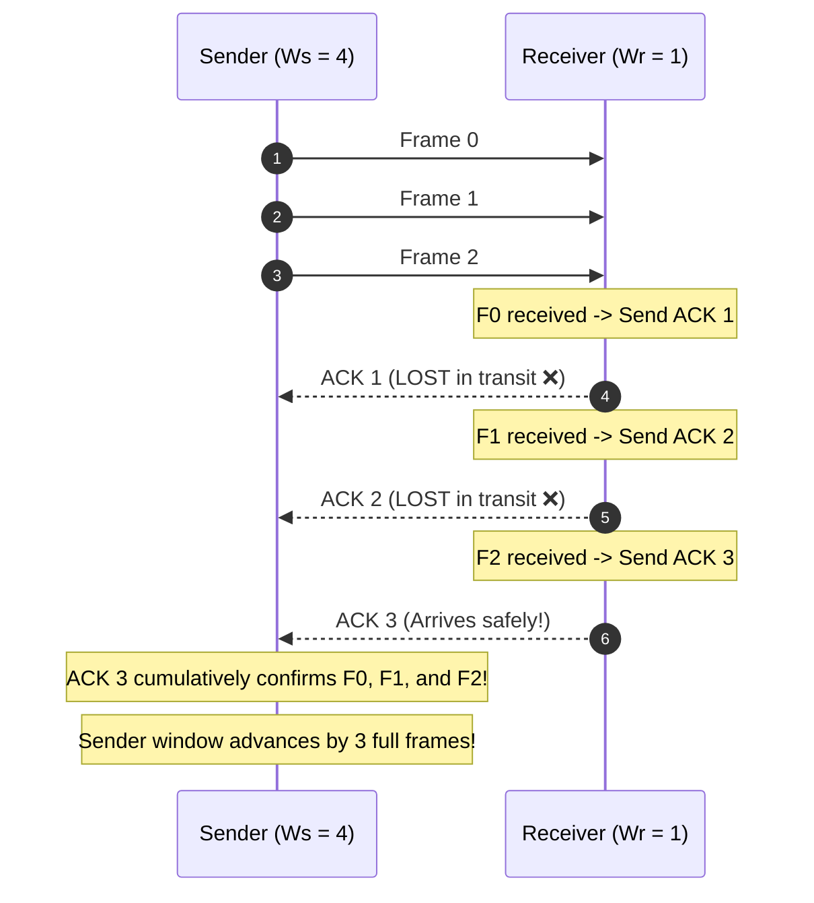

> **What to notice:**
> - Cumulative ACKs make GBN resilient to lost ACKs: as long as a later ACK arrives before timeout, earlier lost ACKs cause no retransmissions.

---

## 8. Selective Repeat (SR) ARQ: Normal Pipelined Flow ($W_s = 4, W_r = 4$)

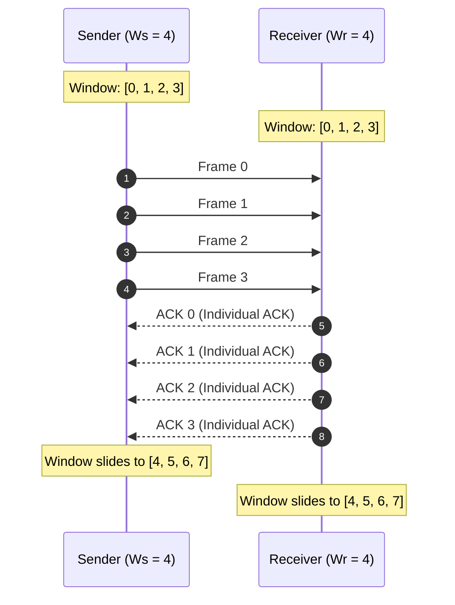

> **What to notice:**
> - In Selective Repeat, acknowledgments are discrete/selective ($ACK_i$ or $SACK$).
> - Both sender and receiver maintain identical buffer capacities of $2^{k-1}$.

---

## 9. Selective Repeat (SR) ARQ: Single Frame Recovery via Out-of-Order Buffering

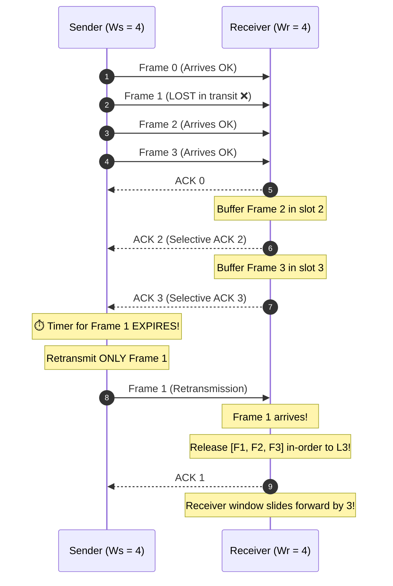

> **What to notice:**
> - Frames 2 and 3 are never retransmitted!
> - Out-of-order frames are held in the receiver's window buffer until the missing frame arrives.

---

## 10. The GBN Overlapping Window Ambiguity Failure ($W_s = 2^k$)

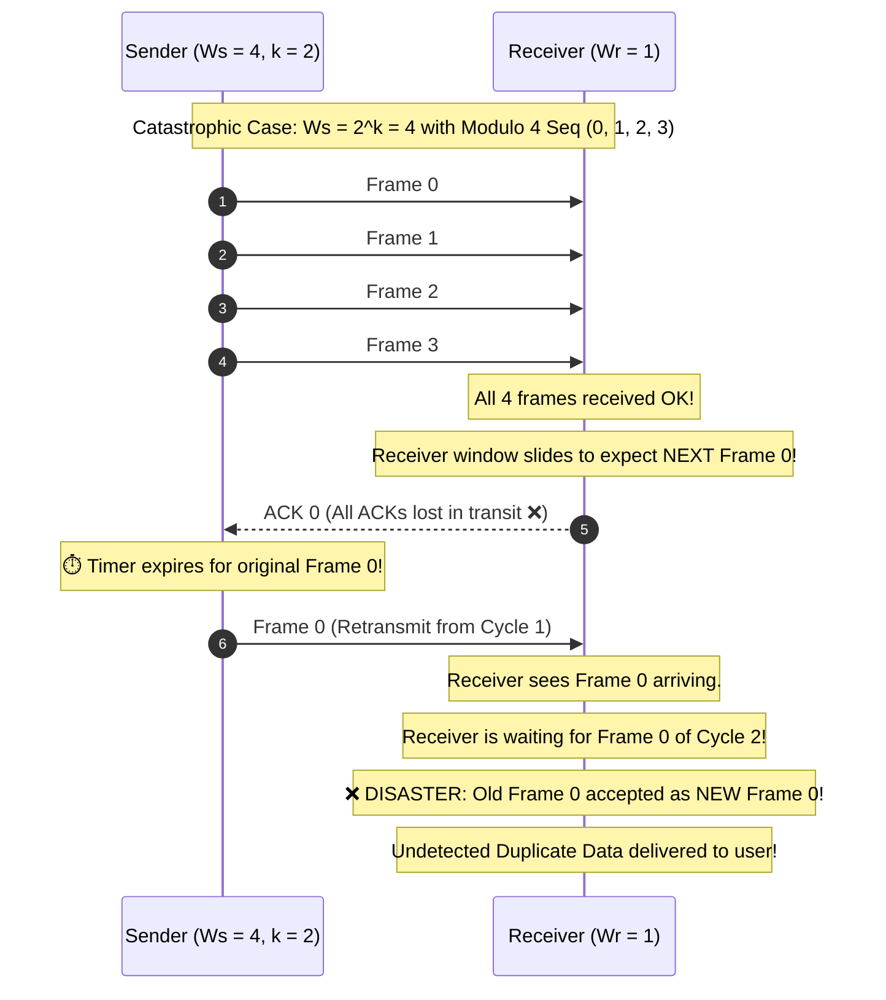

> **What to notice:**
> - When $W_s = 2^k$, the receiver cannot distinguish between an old retransmitted frame and a new frame from the next generation.
> - Setting $W_s \le 2^k - 1$ guarantees that the expected frame sequence number is never identical to the oldest pending unacknowledged frame.

---

## 11. The Selective Repeat Window Overlap Failure ($W_s > 2^{k-1}$)

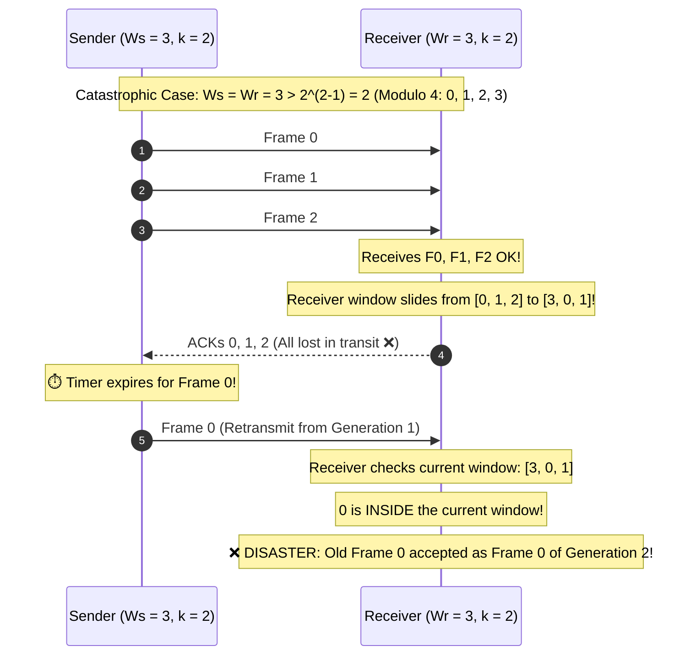

> **What to notice:**
> - In Selective Repeat, $W_s + W_r \le 2^k$ is mandatory. When $W_s = W_r$, the maximum allowable window size is strictly $2^{k-1}$.

---

## 12. Piggybacking Bidirectional Data Flow Timeline

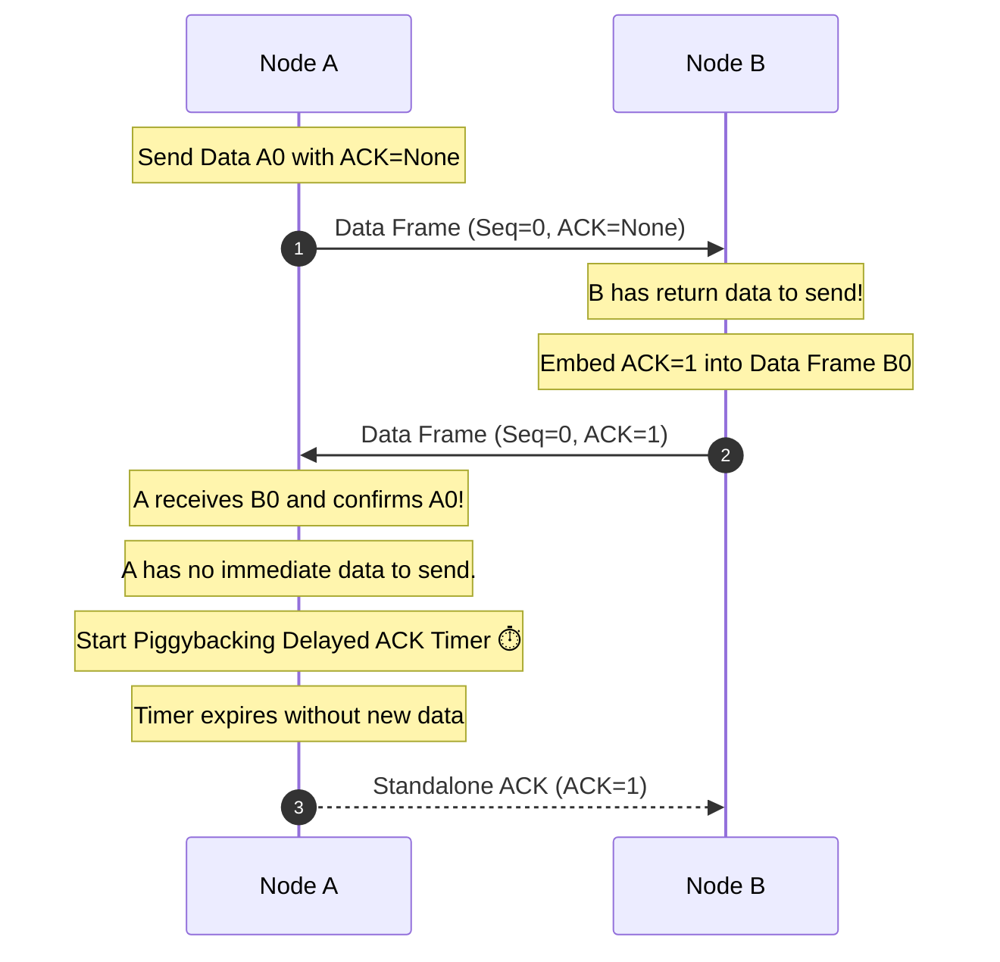

> **What to notice:**
> - Piggybacking replaces standalone ACK frames with dual-purpose data frames, cutting link framing overhead by half.
> - A delayed ACK timer ensures that lone packets still receive timely confirmation if no return traffic exists.

---

## 13. Channel Utilization: Stop-and-Wait vs. Sliding Window

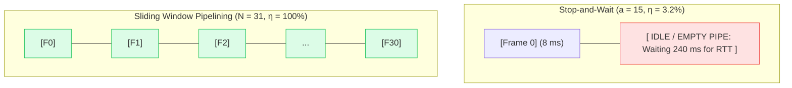

> **What to notice:**
> - When propagation delay dominates ($a \gg 1$), Stop-and-Wait leaves the transmission medium completely starved.
> - Pipelining saturates the pipe with $N = 1 + 2a$ frames, driving link efficiency to $100\%$.

---

## ⬅️ Navigation
- **Module Index:** [INDEX.md](../INDEX.md)
- **Conceptual Notes:** [notes_05b_flow_control.md](notes_05b_flow_control.md)
- **Solved Numericals:** [numericals_05b_flow_control.md](numericals_05b_flow_control.md)
- **Practice MCQs:** [mcqs.md](mcqs.md)
