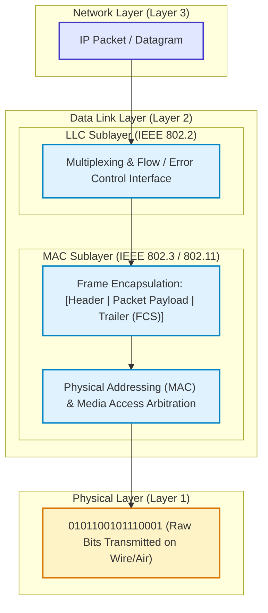
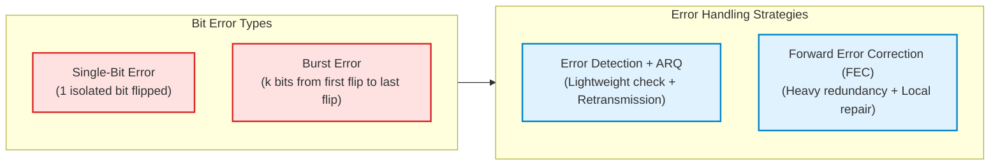
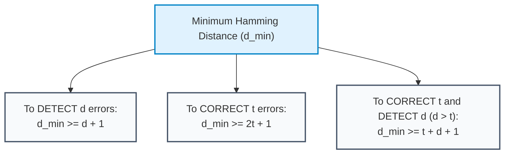
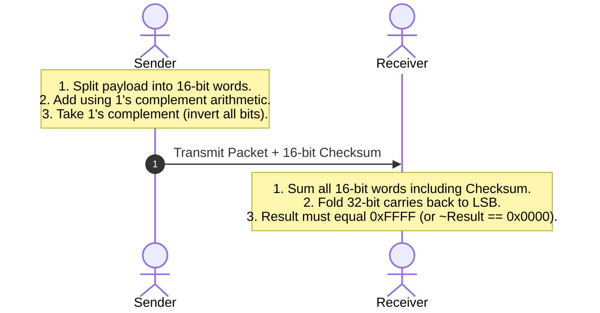
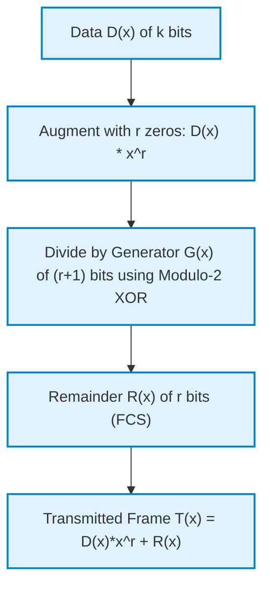

# 05. Data Link Layer (Part A) — Framing & Error Control

> **Master the mechanisms of node-to-node reliability: framing, bit/byte stuffing, parity checks, Internet checksum, Cyclic Redundancy Check (CRC), and Hamming error-correcting codes.**

---

## 1. High-Level Architectural Overview

The **Data Link Layer (Layer 2)** is responsible for **node-to-node (hop-by-hop) delivery** of data across a single physical communication link. While the Physical Layer moves raw, unstructured bitstreams over transmission media, the Data Link Layer transforms that error-prone stream into distinct, manageable data units called **Frames**.



### The Two IEEE 802 Sublayers
To decouple network hardware from link protocols, the IEEE 802 committee divided Layer 2 into:
1. **Logical Link Control (LLC — IEEE 802.2):**  
   - Interfaces directly with the Network Layer above.
   - Provides protocol multiplexing (via Service Access Points or EtherType).
   - Handles hop-by-hop flow control and acknowledgments where required.
2. **Medium Access Control (MAC — IEEE 802.3, 802.11, etc.):**  
   - Interfaces directly with the Physical Layer below.
   - Manages physical hardware addressing (48-bit MAC addresses).
   - Controls shared-medium access arbitration (CSMA/CD, CSMA/CA) and frame delineation.

---

## 2. Framing: Breaking Streams into Packets

Because physical transceivers emit continuous bitstreams, a receiver must determine where each frame begins and ends. If receiver synchronization slips by even one bit, every subsequent byte becomes corrupted (**framing error**).

| Framing Technique | Operating Principle | Primary Vulnerability / Overhead | Where Used |
|---|---|---|---|
| **Character Count** | First byte specifies total frame length | A single bit error in count byte cascades across all frames | Obsolete (historical interest) |
| **Byte Stuffing** | Delimiter `FLAG` bytes with `ESC` escape characters | Variable overhead (up to 100% on binary data) | PPP, BISYNC |
| **Bit Stuffing** | Delimiter flag `01111110` with stuffed `'0'` after five `'1'`s | Low overhead (~1.5% average); bit-level parsing | HDLC, SDLC |
| **Physical Coding Violations** | Out-of-band invalid physical signal states (e.g. Manchester non-transitions) | Requires redundant line coding (e.g. 4B/5B) | Fast Ethernet (100BASE-TX) |

### 2.1 Character Count
The sender includes a fixed-width integer header denoting the total number of characters in the frame (including the count byte itself).
```
[ 5 | A | B | C | D ]  [ 4 | E | F | G ]
```
> [!WARNING]
> **Catastrophic Framing Failure:** If the count byte `5` is corrupted into `6`, the receiver reads one character too many, misinterprets data byte `E` as the next frame's length count, and remains permanently desynchronized until an idle gap occurs.

### 2.2 Flag Bytes with Byte Stuffing (Character-Oriented Framing)
Frames start and end with a designated delimiter byte, typically `FLAG = 0x7E` (`01111110`). If the payload contains the byte pattern `0x7E`, the sender inserts an Escape byte (`ESC = 0x7D`) immediately before it. If an actual `ESC` byte appears in data, it is escaped with another `ESC`.

```
Raw Payload:     [  A   | FLAG |  B   |  ESC  |  C   ]
Stuffed Payload: [ FLAG |  A   | ESC  | FLAG  |  B   | ESC  | ESC  |  C   | FLAG ]
```
- **Sender Rule:** Prepend `ESC` to any occurrence of `FLAG` or `ESC` in user payload.
- **Receiver Rule:** When `ESC` is encountered, strip `ESC` and treat the subsequent byte as literal data.

### 2.3 Bit Stuffing (Bit-Oriented Framing — HDLC Standard)
Used in High-Level Data Link Control (HDLC) and Point-to-Point Protocol (PPP). Every frame is delimited by the 8-bit flag sequence:
$$\text{FLAG} = \mathbf{01111110}_2 \quad (\text{six consecutive } 1\text{s})$$

```
Sender Algorithm:
Whenever the sender's hardware detects five consecutive '1' bits in the user data stream,
it automatically injects a '0' bit immediately after the fifth '1'.

Receiver Algorithm:
Whenever the receiver detects five consecutive '1' bits:
  - If the 6th bit is '0' -> Drop it (it was a stuffed bit; continue parsing).
  - If the 6th bit is '1' and 7th bit is '0' -> FLAG detected (end of frame).
  - If the 6th bit is '1' and 7th bit is '1' -> Channel Error / Abort (invalid sequence).
```

#### Worked Numerical Example (HDLC Bit Stuffing)
**Input Bitstream:**
$$\mathbf{011111101111100111111111110}$$

1. Scan from left:
   - `011111` $\rightarrow$ Five 1s reached! Stuff `0`: `011111`**0**`10`
   - `11111` $\rightarrow$ Five 1s reached! Stuff `0`: `11111`**0**`00`
   - `11111` $\rightarrow$ Five 1s reached! Stuff `0`: `11111`**0**
   - Next 5 bits: `11111` $\rightarrow$ Five 1s reached! Stuff `0`: `11111`**0**`10`
2. **Output Transmitted Bits:**
   $$\mathbf{0111110101111100011111011111010}$$
   Original length = $27\text{ bits}$; Transmitted length = $31\text{ bits}$ ($4$ stuffed zeros).

---

## 3. Error Detection vs. Error Correction

Transmission media suffer from thermal noise, attenuation, signal distortion, and electromagnetic interference (EMI).



- **Single-Bit Error:** Exactly one bit in a data block changes from $0 \rightarrow 1$ or $1 \rightarrow 0$. Common in low-noise optical channels.
- **Burst Error:** Two or more corrupted bits. A burst of length $k$ means the span between the first corrupted bit and the last corrupted bit is $k$ bits, even if intermediate bits remain uncorrupted. Common in wireless (multipath fading) and copper (spark/lightning impulse noise).

### FEC vs. ARQ: The Engineering Trade-off
- **Automatic Repeat reQuest (ARQ):** Sender adds few redundant error-detection bits. If the receiver detects an error, it drops the frame and requests retransmission.  
  *Optimal for:* Low-latency, low error-rate networks (LANs, standard Internet, fiber).
- **Forward Error Correction (FEC):** Sender adds substantial redundancy so the receiver can locate and mathematically correct errors locally without retransmission.  
  *Optimal for:* High-latency links (deep-space, satellite) where RTT is hundreds of milliseconds, or real-time simplex streams where retransmissions arrive too late.

---

## 4. Hamming Distance: Detection & Correction Limits

The **Hamming Distance** $d(x, y)$ between two binary words of equal length is the number of bit positions in which they differ (the number of $1$s in their XOR sum: $x \oplus y$).

For any coding scheme generating a set of valid codewords $C$, the **Minimum Hamming Distance** ($d_{\min}$) is:
$$d_{\min} = \min_{x, y \in C, x \ne y} d(x, y)$$



### The Geometric Proof
- **Error Detection:** If $d$ bits flip, the received vector moves $d$ units away in Hamming space. If $d_{\min} \ge d + 1$, the corrupted vector can never land on another valid codeword; hence, the error is guaranteed to be detected.
- **Error Correction:** To correct $t$ errors, valid codewords must be centers of non-overlapping spheres of radius $t$. To prevent a point from belonging to two spheres:
  $$t + t < d_{\min} \implies d_{\min} \ge 2t + 1$$

---

## 5. Parity Checks (1-D and 2-D)

### 5.1 Simple 1-D Parity
Appends a single bit so the total number of $1$s is even (**Even Parity**) or odd (**Odd Parity**).
- **Even Parity Generator:** $P = d_1 \oplus d_2 \oplus \dots \oplus d_n$
- **Performance:**
  - $d_{\min} = 2$.
  - Detects **all odd numbers of bit errors** ($1, 3, 5, \dots$).
  - Completely **fails on any even number of bit errors** ($2, 4, 6, \dots$).
  - Correction capability: $0$ bits ($t = \lfloor \frac{2-1}{2} \rfloor = 0$).

### 5.2 Two-Dimensional (2-D) Parity
Data is arranged as an $M \times N$ matrix. A parity bit is computed for each row (Horizontal Parity) and each column (Longitudinal Redundancy Check — LRC).

```
         Data Columns     Row Parity
Row 1:   1  0  1  1   ->     1
Row 2:   0  1  1  0   ->     0
Row 3:   1  1  0  1   ->     1
Col Par: 0  0  0  0   ->     0 (Corner Parity)
```

- **Error Detection:** Detects up to **3 arbitrary bit errors**, and all burst errors of length $\le N$.
- **Error Correction:** Can **locate and correct any single-bit error** (the intersection of the invalid row and invalid column identifies the exact erroneous bit).

---

## 6. The Internet Checksum (RFC 1071)

Used at the Network Layer (IPv4 header) and Transport Layer (TCP and UDP pseudo-headers).



### Mathematical Mechanism (1's Complement Sum)
1. Treat data as a sequence of 16-bit integers.
2. Sum words using binary addition.
3. **End-Around Carry:** Whenever a carry out of the most significant bit (bit 16) occurs, wrap the carry bit back and add it to the least significant bit (LSB).
4. Take the **one's complement** (bitwise NOT) of the final sum to form the checksum.

#### Checksum Worked Example
Calculate the checksum for two 16-bit words: `0x4500` and `0x003C`.
1. Binary sum:
   $$\begin{aligned}
   0x4500 &= 0100\text{ }0101\text{ }0000\text{ }0000_2 \\
   0x003C &= 0000\text{ }0000\text{ }0011\text{ }1100_2 \\
   \text{Sum} &= 0100\text{ }0101\text{ }0011\text{ }1100_2 = \mathbf{0x453C}
   \end{aligned}$$
2. Invert bits (One's complement):
   $$\text{Checksum} = \sim(0x453C) = \mathbf{0xBAC3}$$
3. **Receiver Verification:**
   $$\text{Sum} + \text{Checksum} = 0x453C + 0xBAC3 = \mathbf{0xFFFF}$$
   Complement of `0xFFFF` is `0x0000` $\rightarrow$ **Packet verified as error-free!**

---

## 7. Cyclic Redundancy Check (CRC)

CRC is a polynomial code operating in the **Galois Field $GF(2)$**. Addition and subtraction are identical and equivalent to bitwise **XOR** (no carries or borrows).



### 7.1 Generator Polynomial Rules
Let the generator polynomial be $G(x)$ of degree $r$ (represented by $r+1$ binary coefficients).
1. $G(x)$ should have **at least two non-zero terms**: $x^r$ and $x^0$ must be $1$. (Guarantees detection of all single-bit errors).
2. $G(x)$ should contain **$(x + 1)$ as a factor**. (Guarantees detection of **all odd numbers of bit errors**).
3. If $G(x)$ does not divide $x^t + 1$ for any $t < N$, it detects **all double-bit errors** separated by distance $\le N$.
4. **Burst Error Detection:**
   - Any burst error of length $L \le r$ is **100% detected**.
   - A burst of length $L = r + 1$ is detected with probability:
     $$P = 1 - \left(\frac{1}{2}\right)^{r-1}$$
   - A burst of length $L > r + 1$ is detected with probability:
     $$P = 1 - \left(\frac{1}{2}\right)^r$$

### 7.2 Worked CRC Polynomial Long Division Example
Given data $D = \mathbf{100100}$ and generator $G(x) = x^3 + x^2 + 1 \rightarrow G = \mathbf{1101}$ ($r = 3$):

1. **Augment Data:** Append $r = 3$ zeros:
   $$\text{Augmented Data} = 100100000$$
2. **Modulo-2 Binary Division:**
   ```
             111101  (Quotient - discarded)
   1101 | 100100000
          1101
          ----
           1000
           1101
           ----
            1010
            1101
            ----
             1110
             1101
             ----
              0110
              0000
              ----
               1100
               1101
               ----
               0001  -> Remainder (3 bits): 001
   ```
3. **Transmitted Codeword:**
   $$\text{Codeword} = \text{Data} \mid \text{Remainder} = \mathbf{100100001}$$

---

## 8. Hamming Error-Correcting Code

Invented by Richard Hamming in 1950. It is a linear block code that adds $r$ redundant parity bits to $m$ message bits to form an $n = (m + r)$ bit codeword capable of **detecting and correcting single-bit errors**.

### 8.1 The Parity Bit Inequality
To locate an error among $(m + r)$ positions or declare "no error" ($1$ case), $r$ parity bits must encode at least $(m + r + 1)$ distinct states:
$$2^r \ge m + r + 1$$

| Data Bits ($m$) | Redundant Bits ($r$) | Total Bits ($n$) | Code Name | Code Rate ($m/n$) |
|:---:|:---:|:---:|:---:|:---:|
| **4** | **3** | **7** | Hamming(7,4) | 57.1% |
| **8** | **4** | **12** | Hamming(12,8) | 66.7% |
| **11** | **4** | **15** | Hamming(15,11) | 73.3% |
| **16** | **5** | **21** | Hamming(21,16) | 76.2% |

### 8.2 Parity Bit Positions & Coverage
Parity bits occupy bit positions that are **powers of 2** (1-indexed from the left):
$$p_1 \rightarrow \text{Position } 1, \quad p_2 \rightarrow \text{Position } 2, \quad p_4 \rightarrow \text{Position } 4, \quad p_8 \rightarrow \text{Position } 8$$
All remaining positions are assigned to user data bits ($d_3, d_5, d_6, d_7 \dots$).

Each parity bit $p_k$ checks all bit positions whose binary index has a $1$ in bit-weight $k$:
- $p_1$ checks positions with LSB = 1: $\{1, 3, 5, 7, 9, 11, \dots\}$
- $p_2$ checks positions with bit 1 = 1: $\{2, 3, 6, 7, 10, 11, \dots\}$
- $p_4$ checks positions with bit 2 = 1: $\{4, 5, 6, 7, 12, 13, \dots\}$

```
Codeword Bit:     1    2    3    4    5    6    7
Designation:     p1   p2   d3   p4   d5   d6   d7
Binary Index:   001  010  011  100  101  110  111
p1 covers:       X         X         X         X
p2 covers:            X    X              X    X
p4 covers:                      X    X    X    X
```

### 8.3 Syndrome Decoding & Correction
At the receiver, parity checks are recomputed to form the **Syndrome Vector** $S = (s_4 s_2 s_1)_2$:
- If $S = 000_2 = 0$: **No error occurred**.
- If $S \ne 0$: The integer value of $S$ **indicates the exact bit position of the corrupted bit**. Simply invert bit $S$ to correct the error!

---

## 9. Exam Answers vs. Real-World Engineering Reality

> [!IMPORTANT]
> **Golden Rule: Exam Answer First, Real-World Note Second**

| Topic | Academic & GATE Exam Answer | Real-World Engineering Reality | Key Nuance |
|---|---|---|---|
| **CRC Hardware** | Computed via binary polynomial long division tables | Implemented via Linear Feedback Shift Registers (LFSRs) in silicon ASICs | Hardware XOR gates execute 32-bit CRC in a single clock cycle at 100 Gbps. |
| **Error Control at L2** | "Data Link layer guarantees error-free delivery" | Ethernet only **detects** errors via CRC and **drops** bad frames silently | L2 Ethernet provides **unreliable, connectionless** frame delivery; TCP at L4 handles retransmissions. |
| **Parity in LANs** | Taught extensively as fundamental error-detection | Never used alone on serial data cables | Parity is confined to internal CPU caches, DRAM buses (ECC RAM), and PCI buses. |
| **Hamming Code** | Used to correct errors in network frames | Rarely used in wired network frames due to 40%+ header overhead | Hamming codes and Reed-Solomon/LDPC are ubiquitous in NAND flash memory, satellite links, and 5G cellular. |

---

## 10. Top 5 Common Traps & Edge Cases

1. **Generator Polynomial Degree Trap:** A polynomial of degree $r$ has **$r + 1$ binary coefficients**. (e.g. $G(x) = x^4 + x + 1$ has degree $r = 4$, binary divisor $10011$, and appends **4 zeros**, not 5).
2. **HDLC Destuffing Ambiguity:** If a frame contains $0111110$, students often think it is a flag. If there are only five 1s followed by a 0, it is a stuffed zero that must be removed, NOT a flag delimiter!
3. **Hamming Distance Indexing:** Remembering that Hamming parity equations depend on whether the problem uses **1-indexing** (standard) or **0-indexing**.
4. **Internet Checksum Byte-Order:** Checksum is independent of endianness when computed in 16-bit units, but an odd number of payload bytes requires appending a zero-padding byte to calculate the sum.
5. **Detection vs Correction Distance:** To detect $d$ errors requires $d+1$; to correct $d$ errors requires $2d+1$. Conflating the two is the #1 lost mark in GATE error control questions.

---

## 11. Quick Revision Checklist

- [ ] Can perform HDLC bit stuffing and destuffing on a raw 30-bit sequence.
- [ ] Can compute the frame expansion ratio for worst-case flag-filled byte stuffing.
- [ ] Can explain why 1-D parity has $d_{\min} = 2$ and cannot correct any error.
- [ ] Can calculate 16-bit Internet Checksum using one's complement addition and end-around carry.
- [ ] Can execute Modulo-2 binary division for CRC and determine the FCS.
- [ ] Can recite the error-detection guarantees of CRC generator polynomials.
- [ ] Can solve $2^r \ge m + r + 1$ to find required parity bits for any message length.
- [ ] Can construct syndrome equations to locate and flip corrupted bits in Hamming(7,4).

---

## ⬅️ Navigation
- **Module Overview:** [README.md](README.md)
- **Visual Diagrams:** [diagrams.md](diagrams.md)
- **Solved Numericals:** [numericals.md](numericals.md)
- **Practice Questions:** [mcqs.md](mcqs.md)
- **Interview Q&A:** [interview_qa.md](interview_qa.md)
- **One-Page Cheatsheet:** [cheatsheet.md](cheatsheet.md)
- **Next Sub-step:** [05b Flow Control & ARQ](../05_Data_Link_Layer/)
