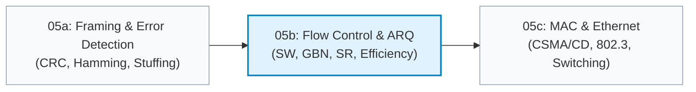
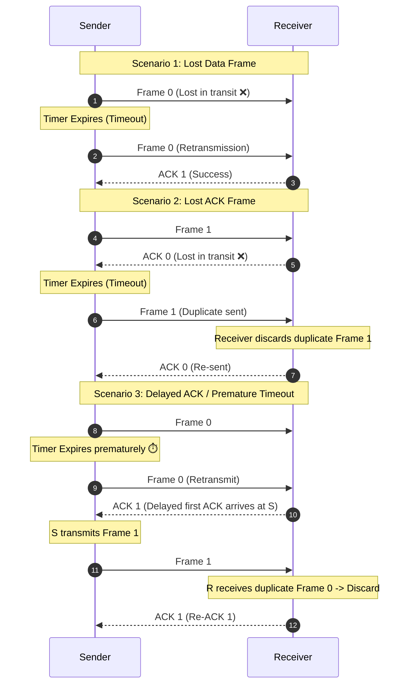

# 05b. Flow Control & Automatic Repeat reQuest (ARQ)

> **Master node-to-node reliability: explore how Stop-and-Wait, Go-Back-N, and Selective Repeat prevent buffer overflow and recover from packet loss across noisy physical channels.**

---

## 🗺️ Where This Fits



---

## 1. Why Flow Control Exists

### 1.1 The Core Dilemma
In any computer network, communicating nodes rarely possess identical processing speeds, memory limits, or CPU availability:
- **Fast Sender, Slow Receiver:** If a high-performance server transmits frames at 10 Gbps to an embedded sensor or overloaded switch whose receiver buffer can only absorb data at 100 Mbps, the receiver buffer fills almost instantly.
- Any subsequent arrival suffers **buffer overflow** and is dropped silently by the receiver NIC hardware.

```
Transmitter [Fast]  ===========================> Receiver [Slow NIC Buffer]
  (Transmits 10 Gbps)    (Frames queuing up)       [■■■■■■■■] -> OVERFLOW!
                                                   Drop Rate: 99%
```

### 1.2 Flow Control vs. Congestion Control

| Characteristic | Flow Control (Layer 2 & Layer 4) | Congestion Control (Layer 3 & Layer 4) |
|---|---|---|
| **Primary Scope** | **End-to-End or Hop-to-Hop:** Prevents sender from overwhelming the **receiver's local buffer**. | **Network-Wide:** Prevents senders from overwhelming **intermediate routers/switches**. |
| **Constraint** | Governed by receiver memory and processing capacity. | Governed by link bandwidth, router queue depths, and cross-traffic. |
| **Feedback Mechanism** | Explicit ACK, window advertisements, or Pause frames. | Packet drops, RTT variance, ECN (Explicit Congestion Notification). |
| **Layer Placement** | Data Link Layer (HDLC, IEEE 802.3x) & Transport Layer (TCP Receive Window). | Network Layer (ICMP Source Quench - obsolete) & Transport Layer (TCP Congestion Window `cwnd`). |

---

## 2. Stop-and-Wait ARQ

### 2.1 Protocol Mechanics
Stop-and-Wait is the simplest flow and error control protocol:
1. The sender transmits **one single frame** ($F_0$).
2. The sender starts a retransmission timer and **stops transmitting**, waiting for an acknowledgment.
3. The receiver accepts $F_0$, verifies its CRC (FCS), delivers the payload to the network layer, and returns an acknowledgment ($ACK_1$, indicating "I received 0, now send 1").
4. Upon receiving the valid ACK, the sender stops the timer and transmits the next frame ($F_1$).

### 2.2 Why Sequence Numbers are Mandatory
Without sequence numbers, even a single delayed or lost packet causes silent data corruption or duplication:
- **Frame Sequence Number:** 1 bit is sufficient ($0$ and $1$).
- **Acknowledgment Number:** 1 bit ($0$ and $1$). $ACK(n)$ signifies either acknowledgment of frame $n$ or request for frame $n$ (academic exams strictly follow $ACK(1)$ = "requesting frame 1").

### 2.3 The Three Failure Scenarios



1. **Lost Data Frame:** The frame vanishes due to link noise. Sender timer expires $\implies$ sender retransmits $F_0$.
2. **Lost ACK Frame:** The frame arrives safely at the receiver, but the ACK is lost. Sender timer expires and retransmits $F_1$. The receiver inspects the sequence number, recognizes $F_1$ as a duplicate, **discards the frame**, and **retransmits $ACK_0$**.
3. **Premature Timeout (Delayed ACK):** The sender's timeout was configured too short. Sender retransmits $F_0$. Meanwhile, the delayed original ACK arrives. The sender advances to $F_1$. When the duplicate $F_0$ arrives at the receiver, it is dropped and an ACK is re-sent.

### 2.4 Mathematical Analysis of Stop-and-Wait
Let:
- $L$ = Frame length (bits)
- $B$ = Link bandwidth / transmission rate (bps)
- $d$ = Distance between nodes (meters)
- $v$ = Signal propagation speed ($2 \times 10^8\text{ m/s}$ in copper/fiber, $3 \times 10^8\text{ m/s}$ in radio/vacuum)
- $T_t = \frac{L}{B}$ = Transmission delay (seconds)
- $T_p = \frac{d}{v}$ = Propagation delay (seconds)
- $T_{ack} = \frac{L_{ack}}{B}$ = Transmission delay of acknowledgment frame
- $T_{proc}$ = Processing delay at receiver

The total time required to transmit one frame and receive its confirmation is the **Cycle Time** ($T_{\text{cycle}}$):
$$T_{\text{cycle}} = T_t + T_p + T_{proc} + T_{ack} + T_p = T_t + 2T_p + T_{ack} + T_{proc}$$

In academic and GATE examinations, $T_{ack}$ and $T_{proc}$ are assumed negligible ($T_{ack} \approx 0, T_{proc} \approx 0$) unless explicit numbers are supplied:
$$T_{\text{cycle}} \approx T_t + 2T_p$$

#### Link Utilization (Efficiency $\eta$)
Efficiency $\eta$ is defined as the fraction of time the channel is actively transmitting useful data:
$$\eta = \frac{\text{Useful Transmission Time}}{\text{Total Cycle Time}} = \frac{T_t}{T_t + 2T_p}$$

Dividing numerator and denominator by $T_t$:
$$\eta = \frac{1}{1 + 2 \cdot \left(\frac{T_p}{T_t}\right)} = \frac{1}{1 + 2a} \quad \text{where } a = \frac{T_p}{T_t}$$

#### Throughput
$$\text{Throughput} = \eta \times B = \frac{L}{T_t + 2T_p}$$

> [!WARNING]
> **The High-Latency Trap (The Satellite Dilemma):**
> On a geostationary satellite link ($d = 36,000\text{ km}$, $T_p = 120\text{ ms}$, $B = 1\text{ Mbps}$, $L = 1000\text{ bytes} = 8000\text{ bits}$):
> $$T_t = \frac{8000}{10^6} = 8\text{ ms}, \quad a = \frac{120}{8} = 15$$
> $$\eta = \frac{1}{1 + 2(15)} = \frac{1}{31} \approx 3.226\% \implies \text{Throughput} = 32.26\text{ kbps}$$
> Stop-and-Wait wastes **$96.77\%$** of the expensive link capacity because the transmission pipe sits completely idle waiting for round-trip propagation!

---

## 3. Sliding Window Fundamentals

### 3.1 Pipelining and the Bandwidth-Delay Product (BDP)
To overcome the catastrophic inefficiency of Stop-and-Wait, protocols utilize **pipelining**: the transmitter emits multiple frames back-to-back before pausing to wait for an acknowledgment.

- **Bandwidth-Delay Product (BDP):** The volume of data that can be in flight simultaneously filling the physical medium pipe:
  $$\text{BDP (bits)} = B \times \text{RTT} = B \times 2T_p$$
- Expressed in units of frames:
  $$\text{BDP (frames)} = \frac{B \times 2T_p}{L} = \frac{2T_p}{T_t} = 2a$$

### 3.2 Sliding Window Efficiency Formula
If the sender transmits a window of $N$ frames continuously within one round-trip cycle:
$$\eta = \min\left(1, \frac{N \cdot T_t}{T_t + 2T_p}\right) = \min\left(1, \frac{N}{1 + 2a}\right)$$

#### Condition for 100% Channel Utilization:
$$\frac{N}{1 + 2a} \ge 1 \implies N \ge 1 + 2a$$
$$\text{Optimal Window Size } N_{\text{opt}} = \lceil 1 + 2a \rceil$$

---

## 4. Go-Back-N (GBN) ARQ

### 4.1 Architecture and Operational Rules
Go-Back-N provides pipelined sliding-window transmission with minimal receiver complexity:

```
Sender Window (Ws = 2^k - 1):          Receiver Window (Wr = 1):
[ 0   1   2   3   4   5   6 ]               [ 3 ]
  |___________|                         (Only accepts Frame 3 in sequence;
   Frames in flight                      drops any frame != 3)
```

1. **Sender Window Size ($W_s$):** $W_s \le 2^k - 1$ where $k$ is the number of bits in the sequence number field.
2. **Receiver Window Size ($W_r$):** Strictly $W_r = 1$. The receiver only has buffer space for **one single in-order frame**.
3. **Cumulative Acknowledgments:** $ACK(n)$ acknowledges receipt of **all frames prior to $n$** and indicates that the receiver is expecting frame $n$.
   - *Advantage:* If $ACK_1$ is lost but $ACK_2$ arrives successfully, the sender knows both Frame 0 and Frame 1 were received safely.
4. **Out-of-Order Frames Discarded:** If frame $i$ is corrupted or lost, all subsequent frames ($i+1, i+2, \dots$) arriving at the receiver are discarded immediately, even if completely undamaged. The receiver re-sends an ACK for the last in-order frame.
5. **Retransmission on Timeout:** The sender maintains a single timer for the oldest unacknowledged frame. When the timer expires, the sender must **Go Back N** frames and retransmit the entire pending window starting from the lost frame.

---

## 5. Selective Repeat (SR) ARQ

### 5.1 Architecture and Operational Rules
Selective Repeat eliminates the redundant retransmissions of Go-Back-N by adding receiver-side buffering:

```
Sender Window (Ws <= 2^(k-1)):         Receiver Window (Wr <= 2^(k-1)):
[ 0   1   2   3 ]                       [ 0   1   2   3 ]
                                        (Accepts and buffers out-of-order
                                         frames within this window)
```

1. **Sender Window Size ($W_s$):** $W_s \le 2^{k-1}$.
2. **Receiver Window Size ($W_r$):** $W_r \le 2^{k-1}$ (in standard implementations, $W_s = W_r = 2^{k-1}$).
3. **Independent / Selective Acknowledgments:** Each frame is individually acknowledged using SACK or specific $ACK(n)$.
4. **Out-of-Order Buffering:** If Frame 1 is lost but Frame 2 and Frame 3 arrive intact, the receiver buffers Frames 2 and 3 and marks them as received. It does not drop them!
5. **Selective Retransmission:** The sender maintains an individual timer for every transmitted frame. When the timer for Frame 1 expires, the sender retransmits **only Frame 1**.
6. **Window Sliding:** Once the missing Frame 1 arrives, the receiver delivers Frames 1, 2, and 3 in order to the network layer, and slides its window forward.

---

## 6. Sequence Number Math & Overlapping Window Proofs

### 6.1 Fundamental Constraint
For any sliding window protocol with modulo-$M$ arithmetic ($M = 2^k$):
$$W_s + W_r \le 2^k$$

### 6.2 The Overlapping Window Proof for Go-Back-N
Why can't GBN use $W_s = 2^k$? Why must $W_s \le 2^k - 1$?

> [!CAUTION]
> **Proof by Contradiction (Failure Scenario with $W_s = 2^k$):**
> Let $k = 2 \implies M = 2^2 = 4$ sequence numbers: $\{0, 1, 2, 3\}$.
> Suppose we set $W_s = 4$ and $W_r = 1$:
> 1. Sender transmits all 4 frames in its window: $F_0, F_1, F_2, F_3$.
> 2. Receiver receives all 4 frames in order. Its window slides forward to expect $F_0$ of the **next cycle**.
> 3. Receiver sends $ACK_4$ (or cumulative ACKs for each frame).
> 4. **Catastrophe:** Link noise corrupts all ACKs in transit. None reach the sender.
> 5. Sender times out on $F_0$ and retransmits $F_0$.
> 6. Receiver receives $F_0$. But the receiver is currently waiting for $F_0$ of the *new* batch!
> 7. The receiver **cannot distinguish** whether this $F_0$ is an old duplicate from cycle 1 or a brand-new frame from cycle 2.
> 8. The receiver accepts the old duplicate as fresh data, causing silent undetected data duplication!
> 
> **Resolution:**
> By setting $W_s = 2^k - 1 = 3$, the sender can only send $\{0, 1, 2\}$. If all ACKs are lost, the sender retransmits $F_0$, while the receiver is expecting $F_3$. Since $0 \ne 3$, the receiver immediately detects the duplicate and discards it!

### 6.3 The Overlapping Window Proof for Selective Repeat
Why must $W_s \le 2^{k-1}$ and $W_r \le 2^{k-1}$?

> [!CAUTION]
> **Failure Scenario with $W_s = W_r > 2^{k-1}$:**
> Let $k = 2 \implies M = 4$ sequence numbers: $\{0, 1, 2, 3\}$. Half-window limit is $2^{2-1} = 2$.
> Suppose we greedily choose $W_s = 3$ and $W_r = 3$:
> 1. Sender transmits $F_0, F_1, F_2$.
> 2. Receiver accepts all three frames, buffers them, and slides its receive window from $\{0, 1, 2\}$ to $\{3, 0, 1\}$.
> 3. Receiver sends $ACK_0, ACK_1, ACK_2$.
> 4. All ACKs are lost in transit.
> 5. Sender timer for $F_0$ expires $\implies$ sender retransmits old $F_0$.
> 6. Receiver receives $F_0$.
> 7. Look at receiver's current window: $\{3, \mathbf{0}, 1\}$. Sequence number $0$ falls **inside** its receive window!
> 8. The receiver assumes this is the brand-new $F_0$ of the second generation, accepts it, and inserts corrupted duplicate data into the application stream!
> 
> **Resolution:**
> We must ensure the oldest possible retransmitted frame ($F_0$) never overlaps with the advanced receive window. Thus:
> $$W_s + W_r \le 2^k \implies 2 W_s \le 2^k \implies W_s \le 2^{k-1}$$
> For $k = 2$, max window size is $2^{2-1} = 2$. If $W_s = W_r = 2$, receive window slides from $\{0, 1\}$ to $\{2, 3\}$. An incoming retransmitted $F_0$ falls outside $\{2, 3\}$ and is safely rejected.

---

## 7. Performance Under Channel Errors

When physical links experience random frame loss with independent error probability $P$:

### 7.1 Stop-and-Wait ARQ Under Loss
Each frame requires a geometric random number of transmission attempts:
$$\mathbb{E}[N_{tx}] = \sum_{i=1}^{\infty} i \cdot P^{i-1}(1 - P) = \frac{1}{1 - P}$$
$$\eta_{\text{eff}} = (1 - P) \cdot \eta_{\text{ideal}} = \frac{1 - P}{1 + 2a}$$

### 7.2 Go-Back-N ARQ Under Loss
In GBN, any lost frame requires retransmitting not only that frame, but all $N-1$ frames that were transmitted while the ACK was pending:
$$\mathbb{E}[N_{tx}] = 1 + N \cdot \frac{P}{1 - P} = \frac{1 + (N - 1)P}{1 - P}$$
$$\eta_{\text{eff, GBN}} = \frac{1 - P}{1 + (N - 1)P} \cdot \min\left(1, \frac{N}{1 + 2a}\right)$$

### 7.3 Selective Repeat ARQ Under Loss
Because only the corrupted frame is retransmitted, errors have zero cascading impact on other frames:
$$\mathbb{E}[N_{tx}] = \frac{1}{1 - P}$$
$$\eta_{\text{eff, SR}} = (1 - P) \cdot \min\left(1, \frac{N}{1 + 2a}\right)$$

---

## 8. Piggybacking

In bidirectional communication (full-duplex links), transmitting standalone ACK frames wastes substantial channel capacity due to PHY/MAC framing overhead:

```
Without Piggybacking:
  Station A ---> [ Data Frame: 1500 B ] ---> Station B
  Station A <--- [ Standalone ACK: 64 B ] <-- Station B

With Piggybacking:
  Station A ---> [ Header (ACK=4) | Data Payload ] ---> Station B
  Station A <--- [ Header (ACK=7) | Data Payload ] <--- Station B
```

- **Mechanism:** When Station B needs to send data back to Station A, it inserts the acknowledgment sequence number into the header of its outgoing data frame.
- **Piggybacking Timer / Delayed ACK:** If Station B has no immediate data to send, it starts a brief timer (typically 50–200 ms). If outbound data is generated before timer expiry, the ACK is piggybacked. If the timer expires, a standalone ACK is dispatched to prevent sender timeout.

---

## 9. Comprehensive Protocol Comparison Matrix

| Metric / Property | Stop-and-Wait ARQ | Go-Back-N (GBN) ARQ | Selective Repeat (SR) ARQ |
|---|---|---|---|
| **Sender Window ($W_s$)** | $1$ | $\le 2^k - 1$ | $\le 2^{k-1}$ |
| **Receiver Window ($W_r$)** | $1$ | $1$ | $\le 2^{k-1}$ (normally $W_s$) |
| **Min Sequence Bits ($k$)** | $1$ bit (0 and 1) | $\lceil \log_2(W_s + 1) \rceil$ | $\lceil \log_2(2 W_s) \rceil$ |
| **Out-of-Order Handling** | Discarded | Discarded immediately | Accepted and buffered |
| **Receiver Buffer Size** | $1$ frame | $1$ frame | $W_r$ frames ($2^{k-1}$) |
| **Acknowledgment Type** | Individual ($ACK_0, ACK_1$) | Cumulative ($ACK_n$) | Individual / Selective ($SACK$) |
| **Retransmission on Loss** | Single frame | Entire window ($N$ frames) | Only the lost frame |
| **Timer Count** | $1$ timer | $1$ timer (oldest frame) | $N$ timers (one per frame) |
| **Channel Efficiency ($\eta$)** | $\frac{1}{1 + 2a}$ | $\min(1, \frac{N}{1 + 2a})$ | $\min(1, \frac{N}{1 + 2a})$ |
| **Loss Sensitivity** | Moderate | Very High (drops rapidly) | Low (graceful degradation) |
| **Hardware Complexity** | Minimal | Low | High (buffer management & sorting) |
| **Real-World Examples** | TFTP, XMODEM | Early TCP, HDLC | Modern TCP (RFC 2018 SACK) |

---

## 10. Exam Traps vs. Real-World Engineering

1. **Exam Answer:** *"The Data Link Layer provides reliable node-to-node delivery using sliding window ARQ protocols (HDLC, LAPB)."*
   - **Real-World Engineering:** In modern high-speed networks, **Ethernet (IEEE 802.3) and Wi-Fi (802.11) do NOT perform GBN or SR ARQ at Layer 2 across wired links**. Fiber and copper error rates are tiny ($< 10^{-12}$). If a frame fails CRC, Ethernet drops it silently. End-to-end reliability is completely delegated to Layer 4 TCP! (Wi-Fi uses Stop-and-Wait/Block ACK at Layer 2 only because the wireless air interface is uniquely noisy).
2. **The Sequence Number Ambiguity Trap:** When GATE asks *"What is the minimum number of sequence bits for window size $N$ in GBN?"*, students often answer $\log_2(N)$. The correct answer is $\lceil \log_2(N + 1) \rceil$ because $W_s \le 2^k - 1$.
3. **The Window Sum Rule:** Always verify $W_s + W_r \le 2^k$. If this inequality is violated, window overlap and silent data corruption will occur.

---

## ⬅️ Navigation
- **Module Index:** [INDEX.md](../INDEX.md)
- **Previous Topic:** [05a: Framing & Error Control](notes.md)
- **Next Topic:** [05c: MAC Protocols & Ethernet](notes.md#next)
- **Practice MCQs:** [mcqs.md](mcqs.md)
- **Solved Numericals:** [numericals_05b_flow_control.md](numericals_05b_flow_control.md)
- **Mermaid Diagrams:** [diagrams_05b_flow_control.md](diagrams_05b_flow_control.md)
