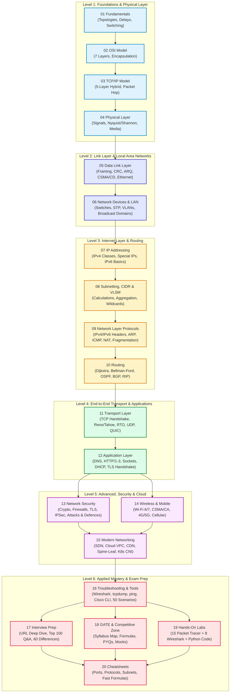

# Computer Networking Mastery

[](LICENSE)
[](CONTRIBUTING.md)
[](18_GATE_and_Competitive_Zone/README.md)
[](PROGRESS.md)

> **The ultimate, visual, zero-to-advanced Computer Networking repository.**  
> Designed for complete beginners, college university exams, GATE CS/IT, campus placements, product engineering interviews (Amazon, Google, Microsoft), and CCNA/Network+ industry certifications.

---

## 🎯 What, Who, and Why

- **What:** A self-contained, crystal-clear, visual, and mathematically rigorous curriculum covering computer networking from physical bits up to distributed web applications and modern cloud architectures.
- **Who:** Absolute beginners with zero prior networking background, college engineering students, GATE/PSU aspirants preparing for numericals & MSQs, software engineers preparing for systems/infrastructure interviews, and network engineers aiming for CCNA/Network+.
- **Why:** Most networking tutorials are either dry RFC dumps, vague high-level slide decks, or scattered across disjointed sites. This repo explains **why** a technology exists before **what** it is and **how** it works, backed by **Mermaid diagrams, verified formulas, Python simulation scripts, real packet headers, and exam-proven questions**.

---

## 🧭 How to Learn From This Repository

1. **Pick your target path** in [START_HERE.md](START_HERE.md) based on your deadline and learning goal.
2. **Follow topics in numbered sequence** (bottom of the protocol stack to top) for the deepest intuition.
3. **Read `notes.md`** first — every concept starts with a simple real-world analogy and step-by-step breakdown.
4. **Inspect `diagrams.md`** — study the Mermaid sequence, flowcharts, and packet structures.
5. **Solve `numericals.md`** — master calculation problems with step-by-step verified solutions.
6. **Self-test with `mcqs.md`** — 50+ balanced questions per topic (MCQ, MSQ, NAT, output scenarios) with hidden answers and misconceptions debunked.

---

## 🗺️ Visual Learning Roadmap



---

## 📚 Curriculum & Module Overview

| # | Module Name | Core Highlights | Est. Time | GATE Weight | Interview Weight | Status |
|---|---|---|:---:|:---:|:---:|:---:|
| **01** | [01_Fundamentals](01_Fundamentals/notes.md) | Topologies, Delays (Tt, Tp, Tq, Tproc), Switching, BDP | 3–4 hrs | Medium | High | 🚧 Rebuilding |
| **02** | [02_OSI_Model](02_OSI_Model/notes.md) | 7 Layers, Encapsulation, Headers/Trailers, Troubleshooting | 3–4 hrs | Low–Med | Very High | 🚧 Rebuilding |
| **03** | [03_TCP_IP_Model](03_TCP_IP_Model/notes.md) | 5-Layer Hybrid Model, Packet Hop Journey, Protocol Matrix | 3–4 hrs | Medium | High | 🚧 Rebuilding |
| **04** | [04_Physical_Layer](04_Physical_Layer/) | Nyquist, Shannon Capacity, Line Coding, Media, Modulation | 4–5 hrs | Medium | Medium | 📋 Planned (Phase 2) |
| **05** | [05_Data_Link_Layer](05_Data_Link_Layer/) | CRC, Hamming, Stop-and-Wait, GBN, SR, CSMA/CD, Ethernet | 8–10 hrs | **Highest** | High | 📋 Planned (Phase 2) |
| **06** | [06_Network_Devices_and_LAN](06_Network_Devices_and_LAN/notes.md) | Hubs vs Switches, STP Elections, VLANs, 802.1Q, Domains | 5–6 hrs | Medium | High | 🚧 Rebuilding |
| **07** | [07_IP_Addressing](07_IP_Addressing/notes.md) | IPv4 Classes, Special Blocks, IPv6 Addressing, EUI-64 | 4–5 hrs | Medium | Very High | 🚧 Rebuilding |
| **08** | [08_Subnetting_CIDR_VLSM](08_Subnetting_CIDR_VLSM/notes.md) | Fast Subnetting, VLSM, CIDR Aggregation, 45 Numericals | 6–8 hrs | High | **Highest** | 🚧 Rebuilding |
| **09** | [09_Network_Layer_Protocols](09_Network_Layer_Protocols/) | IPv4 Header, Fragmentation, ARP, ICMP, NAT/PAT, IPv6 Header | 6–7 hrs | High | High | 📋 Planned (Phase 4) |
| **10** | [10_Routing](10_Routing/notes.md) | Dijkstra SPF, Bellman-Ford, OSPF, BGP, RIP, LPM | 7–8 hrs | High | High | 🚧 Rebuilding |
| **11** | [11_Transport_Layer](11_Transport_Layer/notes.md) | TCP Handshake/Teardown, Tahoe vs Reno, States, RTO, UDP | 8–10 hrs | **Highest** | **Highest** | 🚧 Rebuilding |
| **12** | [12_Application_Layer](12_Application_Layer/notes.md) | DNS, HTTP/1.1/2/3, Socket Code, DHCP DORA, TLS 1.3 | 6–8 hrs | High | **Highest** | 🚧 Rebuilding |
| **13** | [13_Network_Security](13_Network_Security/) | Cryptography (RSA/DH/AES), Firewalls, ACLs, TLS, IPsec | 6–8 hrs | Medium | High | 📋 Planned (Phase 7) |
| **14** | [14_Wireless_and_Mobile](14_Wireless_and_Mobile/) | 802.11 Wi-Fi, CSMA/CA, WPA3, 4G LTE/5G Slicing | 4–5 hrs | Low–Med | Medium | 📋 Planned (Phase 7) |
| **15** | [15_Modern_Networking](15_Modern_Networking/) | SDN, Cloud VPC, Load Balancers, CDN, Spine-Leaf, K8s CNI | 5–6 hrs | Low | Very High | 📋 Planned (Phase 8) |
| **16** | [16_Troubleshooting_and_Tools](16_Troubleshooting_and_Tools/) | Wireshark, tcpdump, ping, traceroute, Cisco CLI, 50 Scenarios | 5–6 hrs | Low | Very High | 📋 Planned (Phase 8) |
| **17** | [17_Interview_Prep](17_Interview_Prep/) | "What happens when you type a URL", Top 100 Q&A, 60 Diffs | 6–8 hrs | N/A | **Highest** | 📋 Planned (Phase 9) |
| **18** | [18_GATE_and_Competitive_Zone](18_GATE_and_Competitive_Zone/) | Syllabus Map, Master Formula Sheet, PYQ Solutions, Mocks | 10–12 hrs | **Benchmark** | Medium | 📋 Planned (Phase 9) |
| **19** | [19_Hands_On_Labs](19_Hands_On_Labs/) | 15 Packet Tracer CLI Labs, 8 Wireshark Labs, Python Code | 10–15 hrs | Medium | Very High | 📋 Planned (Phase 10) |
| **20** | [20_Cheatsheets](20_Cheatsheets/) | 100 Protocols/Ports, One-Page Revision Sheets, Formulas | 2–3 hrs | High | High | 📋 Planned (Phase 10) |

*Status key: ✅ Verified Complete | 🚧 Rebuilding / Expanding | 📋 Planned in Phase Roadmap*

---

## 🎯 Choose Your Track

| Track | Who It Is For | Recommended Path | Plan |
|---|---|---|---|
| **🟢 Absolute Beginner** | Starting from zero, wanting clear intuition | Modules 01 → 02 → 03 → 04 → 05 → 06 → 07 → 08 → 09 → 11 → 12 | [30-Day Plan](STUDY_PLANS.md#30-day-foundation-plan) |
| **🎓 College Exams** | University syllabus (B.Tech / BCA / MCA / BSc CS) | All modules 01 to 12 + 13 & 16 + Cheatsheets | [7-Day Crash](STUDY_PLANS.md#7-day-exam-cram-plan) |
| **🏆 GATE CS/IT** | Numerical mastery, MSQ precision, high marks | Focus: 01, 04, 05, 07, 08, 09, 10, 11 + Module 18 | [90-Day GATE Plan](STUDY_PLANS.md#90-day-gate-csit-mastery-plan) |
| **💼 Software Engineering Interviews** | Amazon, Google, Microsoft, SRE, DevOps | Focus: 02, 07, 08, 11, 12, 15, 16 + Module 17 | [14-Day Interview Plan](STUDY_PLANS.md#14-day-interview-sprint) |
| **🌐 Network Engineer / CCNA** | Enterprise LAN/WAN, Cisco CLI, operations | Focus: 04, 05, 06, 07, 08, 09, 10, 16 + Module 19 | [60-Day Deep Dive](STUDY_PLANS.md#60-day-complete-engineer-plan) |

👉 **Read the complete onboarding guide in [START_HERE.md](START_HERE.md)**.

---

## 📂 Standard File Architecture Per Topic

Every core topic folder (`01` through `16`) strictly follows this structure:

```text
<Topic_Folder>/
├── README.md        ← Module overview, time budget, prerequisites, "Where this fits" map, next links
├── notes.md         ← Full conceptual deep-dive (analogy → plain English → math/headers → real world)
├── diagrams.md      ← Mermaid sequence/flowcharts + SVG packet layouts (minimum 8-15 visual diagrams)
├── numericals.md    ← Solved calculations in 3 levels (Basic, Exam, GATE-hard) verified with Python
├── mcqs.md          ← 50+ questions (30 MCQs, 10 MSQs, 10 NAT, 5 Output scenarios) with balanced options
├── interview_qa.md  ← Top questions with 30-second summary and detailed 2-minute answers
└── cheatsheet.md    ← One-page quick revision sheet
```

---

## 🛠️ Verification & Quality Assurance

All numerical calculations, CIDR masks, throughput formulas, and checksums in this repository are verified using reproducible Python scripts in `tools/verify/`. No hand-waving or unverified numbers.

---

## 🤝 Contributing

We welcome corrections, new diagrams, verified numerical solutions, and lab scenarios. Please review [CONTRIBUTING.md](CONTRIBUTING.md) and our [CODE_OF_CONDUCT.md](CODE_OF_CONDUCT.md).

---

## 📄 License

This project is licensed under the [MIT License](LICENSE).
