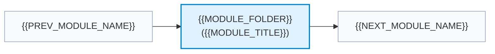

# {{MODULE_NUM}}. {{MODULE_TITLE}}

> **{{MODULE_SUBTITLE}}**

| ⏱️ Time Budget | 🎯 Target Level | 📌 GATE Weight | 💼 Interview Weight |
|---|---|---|---|
| {{TIME_BUDGET}} | {{TARGET_LEVEL}} | {{GATE_WEIGHT}} | {{INTERVIEW_WEIGHT}} |

---

## 🗺️ Where This Fits

---

## 📋 Prerequisites

{{PREREQUISITES}}

---

## 🎯 What You Will Learn (Checklist)

- [ ] **Core Concepts:** {{CORE_CONCEPTS_CHECKLIST}}
- [ ] **Architecture & Mechanics:** {{ARCHITECTURE_CHECKLIST}}
- [ ] **Calculations & Formulas:** {{FORMULAS_CHECKLIST}}
- [ ] **Exam & Interview High Yields:** {{EXAM_CHECKLIST}}

---

## 📂 Files in This Module

| File | What It Gives You | Time |
|---|---|:---:|
| [notes.md](notes.md) | Comprehensive deep-dive notes with theory, diagrams, and edge cases | 60–75 min |
| [diagrams.md](diagrams.md) | 10 Mermaid architectural, flow, and timing sequence diagrams | 25–30 min |
| [numericals.md](numericals.md) | Solved calculations across 3 levels (Basic, Exam, GATE-hard) verified with Python | 40–50 min |
| [mcqs.md](mcqs.md) | 55 practice questions (30 MCQs, 10 MSQs, 10 NATs, 5 Scenarios) with balanced keys | 45–60 min |
| [interview_qa.md](interview_qa.md) | High-yield interview questions with 30-second rapid summaries and deep answers | 25–35 min |
| [cheatsheet.md](cheatsheet.md) | High-yield one-page revision sheet summarizing tables, formulas, and traps | 10–15 min |

---

## ⬅️ Navigation
- **Module Index:** [INDEX.md](../INDEX.md)
- **Previous Module:** [{{PREV_MODULE_NAME}}](../{{PREV_MODULE_FOLDER}}/README.md)
- **Next Module:** [{{NEXT_MODULE_NAME}}](../{{NEXT_MODULE_FOLDER}}/README.md)
