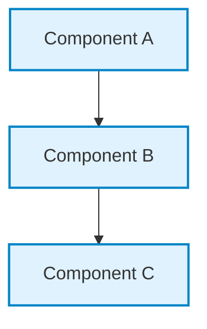

# {{MODULE_NUM}}. {{MODULE_TITLE}} — Deep-Dive Lecture Notes

> **Comprehensive conceptual, architectural, mathematical, and implementation notes.**

---

## 1. High-Level Architectural Overview

---

## 2. Theoretical Foundations & Mechanics

### 2.1 Core Concepts
Detailed explanation with formal definitions and analogies.

> [!NOTE]
> Essential background and underlying principles.

### 2.2 Operational Mechanics
Step-by-step breakdown of how data and control signals flow.

> [!TIP]
> Practical intuition and implementation insights.

---

## 3. Mathematical Foundations & Formulas

Key equations governing this layer:

$$\text{Formula} = \text{Expression}$$

Where:
- Variable 1: Description and standard units
- Variable 2: Description and standard units

> [!IMPORTANT]
> Units and common unit conversion traps (bits vs Bytes, ms vs s, decimal vs binary prefixes).

---

## 4. Exam Answers vs. Real-World Engineering Reality

> [!IMPORTANT]
> **Golden Rule: Exam Answer First, Real-World Note Second**  
> Where textbook definitions (Forouzan, Kurose, GATE syllabus) diverge from modern production implementations, always lead with the exam answer, followed by a concise real-world note.

| Topic / Protocol | Academic & Exam Answer | Real-World Engineering Reality | Key Nuance |
|---|---|---|---|
| Example Protocol | **Layer X** | Implemented at Layer Y | Explanation of duality |

---

## 5. Common Edge Cases & Traps

1. **Trap 1:** Explanation of misconception.
2. **Trap 2:** Explanation of misconception.

> [!WARNING]
> High-risk exam pitfall or production outage pattern.

---

## 6. Quick Revision Checklist

- [ ] Can define the primary responsibilities and PDUs.
- [ ] Can draw the end-to-end mechanism flowchart from memory.
- [ ] Can solve standard numerical problems without reference tables.
- [ ] Can articulate the exam vs real-world distinction for edge protocols.

---

## ⬅️ Navigation
- **Module Overview:** [README.md](README.md)
- **Visual Diagrams:** [diagrams.md](diagrams.md)
- **Solved Numericals:** [numericals.md](numericals.md)
- **Practice Questions:** [mcqs.md](mcqs.md)
- **Interview Q&A:** [interview_qa.md](interview_qa.md)
- **Cheatsheet:** [cheatsheet.md](cheatsheet.md)
- **Next Module:** [{{NEXT_MODULE_NAME}}](../{{NEXT_MODULE_FOLDER}}/README.md)
